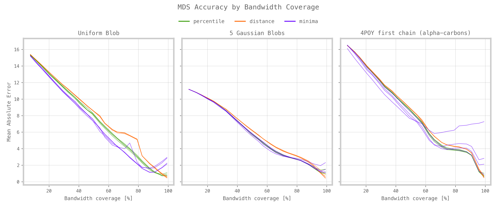
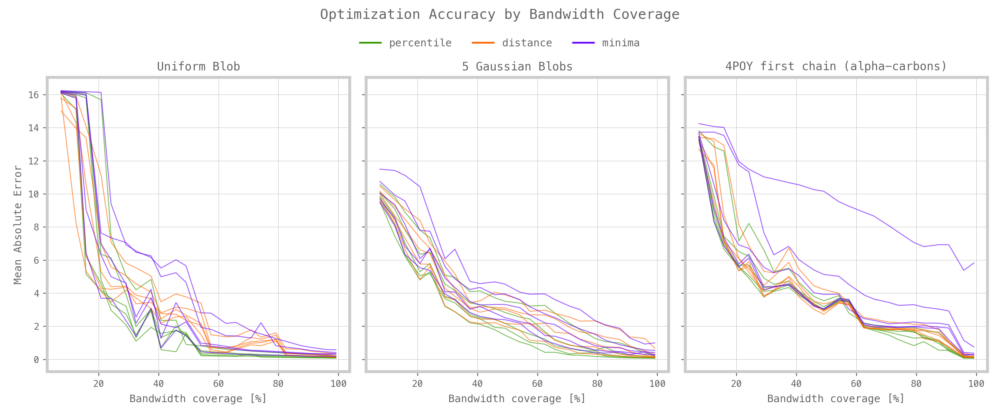

# Annex 1
# Three-dimensional Structure Recovery through Gradient-Based Optimization

This short study proposes an empirical framework for tuning the parameters of an optimization pipeline designed to reconstruct the three-dimensional expression of a structure from partial contact maps. These contact maps, derived from local fragment predictions based on sequence subsequences, represent incomplete spatial interaction data. To recover the full 3D structure, a process comparable to a "reverse embedding" is employed, which maps the partial contact information back into spatial coordinates.

The study shows that the inversion process — despite the inherent loss of information caused by encoding continuous numerical values into binary, featurized contact maps — can approximate the original spatial configurations with reasonable accuracy, thereby rendering the embedding process partially reversible. However, the quality of the recovered structures strongly depends on the amount of available data, as well as on parameters such as the numerical range boundaries that define the distribution of contacts within the maps, or the amount of maps involved.

**Data**

Three sets of coordinates, each representing a distinct structural configuration, are analyzed to explore contrastive spatial distributions:
<ol type="1"><li><strong>Single Large Point Cloud</strong> – A synthetically generated, uniformly distributed set of points forming one uncentered cluster.
</li>
<li><strong>Multiple Small Point Clouds</strong> – A synthetic configuration composed of several smaller, spatially disparate clusters sampled from a Gaussian distribution. 
</li>
<li><strong>Real-World Nanoprotein Data</strong> – Empirical atomic coordinates of the alpha-carbon atoms of protein 4POY, chain A residues, exhibiting a naturally "organic" spatial distribution.
</li></ol>

For the sake of comparison, all three sets contain an identical number of points (120), and are normalized to comparable spatial scales, with the maximum inter-point distance approximately 35 units in each case.

**Embedding**

The original 3D coordinates are converted into pairwise distance matrices using standard Euclidean norm. Each point is then represented as a 120-dimensional vector, capturing its distances to all other points in the structure. The distance matrices are symmetric, with zeros along the main diagonal.

The resulting distance matrices are then converted into range-based contact maps, based on two key parameters: the <b>number of discrete ranges</b> used for data partitioning, and the <b>numerical boundaries</b> that define these ranges. A set of basic constraints is imposed: given the continuous nature of pairwise distance distributions in each dataset, the range domains are defined to cover the entire extent of the distance domain. Additionally, to prevent ambiguous contact information and ensure the resulting contact maps remain compatible with probabilistic operations, the domains are contiguous and non-overlapping.

The specific distribution of each structure leads us to consider several approaches to domain partitioning : 
<ol type="a">
  <li><u>Percentiles</u>. A quantitative boundary ensures the homogeneous distribution of contacts between domains;</li>
  <li><u>Sectors</u>. Qualitative demarcation, distributing distances between sectors of equal width;</li>
  <li><u>Structural</u>. An “organic” demarcation based on the “ripples” visible on certain distribution curves, sensitive to the intrinsic structure of the data.</li>
</ol>

**Process**

1.	Logit initialization. A first matrix of distances is produced by taking a uniform random value within the boundaries of the respective domains expressed by the contacts; the matrix is then reduced to three dimensions via a classical MDS (Multidimensional Scaling); these values constitute a first approximation of the 3D coordinates and are used to initialize a table of logits;

2.	Optimization. Logits are fed into an optimization loop, which translates them into relative distances and compares them with contact information. This optimization process relies entirely on a double sigmoid which “validates” the proposed values when they fall within the expected range, and penalizes them when they fall outside it, all in a continuous and differentiable manner (soft ranges). Proposed values are compared with target values by BCE.

3.	The process returns a set of three-dimensional coordinates whose relative distances correspond as closely as possible to the contact maps.

Sample preliminary tests were carried out with three distinct spatial structures: a homogeneous point cloud, a heterogeneous cloud and a nanoprotein. 

**MDS pipeline**:

Our analysis revealed that coordinate recovery was straightforward when complete distance matrices were available, with Multidimensional Scaling achieving extremely low error (MAE = 0.0000 for uniform structures) in very short process time. However, when using contact matrices with information loss, MDS relied on prototype distance matrices based on random sampling from contact domains. We found that:
- Partitioning into sectors of identical width gave optimal results
- Percentile partitioning followed closely in performance  
- Structural partitioning yielded least accurate results
  

**Gradient-Based Optimization**:

Our systematic analysis revealed significant improvements over MDS prototypes using Gradient-Based Optimization:
- **Error Reduction**: Mean absolute error greatly reduced with significant improvement between 0-20% coverage
- **Coverage Optimization**: For protein structures, performance plateaued around 60% coverage
- **Domain Number Impact**: More contact matrix domains consistently improved reconstruction quality
- **Partitioning Strategy Reversal**: Percentile partitioning proved most efficient for optimization, while structural partitioning was least effective

