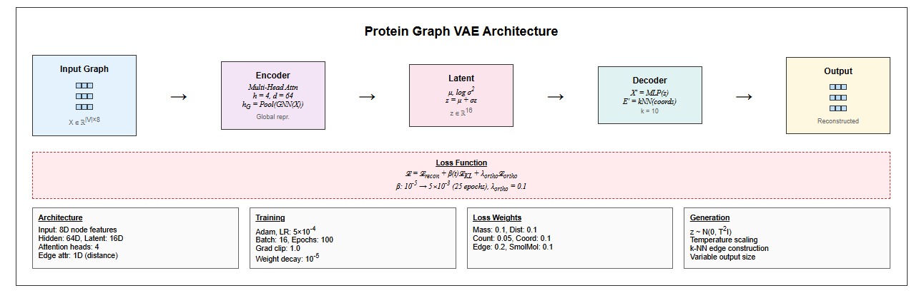
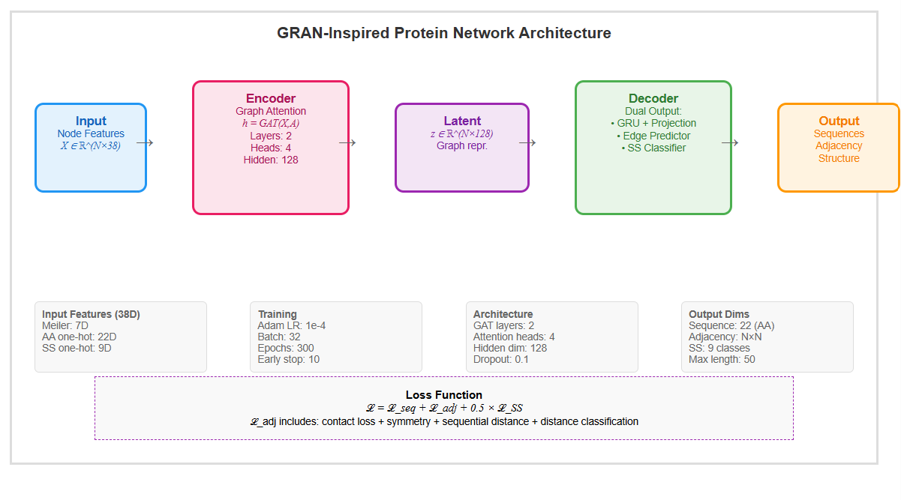

**Alex Chilton**  
(addresse)   
alex_chilton@gmx.co.uk   

**Lauro Foletti**  
Rue de la Balance 1 CH &mdash; 2000 Neuchâtel   
lauro.foletti@gmail.com 

**Lara Nonis**  
(addresse)   
lara.nonis01@gmail.com  

Data Science Project

<h1 style="font-size: 35px; line-height: 1.2; margin: 20px 0; border-bottom: none; text-decoration: none;">
(Title TBD)
</h1>

15 June 2025

## Abstract

Lorem ipsum dolor sit amet, consectetur adipiscing elit, sed do eiusmod tempor incididunt ut labore et dolore magna aliqua. Ut enim ad minim veniam, quis nostrud exercitation ullamco laboris nisi ut aliquip ex ea commodo consequat. Duis aute irure dolor in reprehenderit in voluptate velit esse cillum dolore eu fugiat nulla pariatur. Excepteur sint occaecat cupidatat non proident, sunt in culpa qui officia deserunt mollit anim id est laborum

## Table of contents  

- [Abstract](#abstract)
- [Table of contents](#table-of-contents)
- [1. Introduction and project scope](#1-introduction-and-project-scope)
  - [1.1 Biological and computational context](#11-biological-and-computational-context)
  - [1.2 Project objectives and evolution](#12-project-objectives-and-evolution)
- [2. Infrastructure and development environment](#2-infrastructure-and-development-environment)
- [3. Data](#3-data)
- [4. Metadata](#4-metadata)
- [5. Data quality](#5-data-quality)
- [6. Data flow](#6-data-flow)
  - [6.1 Parsing](#61-parsing)
  - [6.2 Preprocessing and feature engineering](#62-preprocessing-and-feature-engineering)
    - [6.2.1 Geometric feature engineering and structural analysis](#621-geometric-feature-engineering-and-structural-analysis)
    - [6.2.2 Physicochemical property integration:](#622-physicochemical-property-integration)
    - [6.2.3 Graph structure and feature integration](#623-graph-structure-and-feature-integration)
  - [6.3 Additional datasets for model validation and testing](#63-additional-datasets-for-model-validation-and-testing)
- [7. Model flow](#7-model-flow)
  - [7.1 Graph Variational Autoencoder (GraphVAE)](#71-graph-variational-autoencoder-graphvae)
  - [7.2 Hybrid Learning Inversion Framework](#72-hybrid-learning-inversion-framework)
    - [7.2.1 Data Fragmentation](#721-data-fragmentation)
    - [7.2.2 Embedding](#722-embedding)
    - [7.2.3 Modified Variational AutoEncoder (VAE)](#723-modified-variational-autoencoder-vae)
    - [7.2.4 Aggregation](#724-aggregation)
    - [7.2.5 Data Recovery through gradient-based optimization](#725-data-recovery-through-gradient-based-optimization)
    - [7.2.6 Benefits and Drawbacks](#726-benefits-and-drawbacks)
  - [7.3 Additional diagnostic experiments](#73-additional-diagnostic-experiments)
  - [7.4 Graph recurrent attention network (GRAN)-inspired dual output architecture](#74-graph-recurrent-attention-network-gran-inspired-dual-output-architecture)
    - [7.4.1 Model architecture](#741-model-architecture)
    - [7.4.2 Additional preprocessing and the generation process](#742-additional-preprocessing-and-the-generation-process)
    - [7.4.3 Training performance and model convergence](#743-training-performance-and-model-convergence)
    - [7.4.4 Benefits and drawbacks](#744-benefits-and-drawbacks)
- [Conclusions (first bit only now)](#conclusions-first-bit-only-now)
- [References](#references)
- [List of Figures](#list-of-figures)
- [List of Tables](#list-of-tables)
- [Appendix](#appendix)
  - [Appendix 1: GRAN loss function](#appendix-1-gran-loss-function)

## 1. Introduction and project scope

### 1.1 Biological and computational context

Proteins are the most abundant biological macromolecules, present in all living creatures. They exhibit substantial diversity in both size and function, ranging from small peptides to large polymeric complexes. Functionally, proteins are central to virtually all biological processes and represent the primary end products of genetic information pathways. Structurally, proteins are linear polymers of amino acids linked by peptide bonds. Twenty standard α-amino acids constitute protein sequences, each containing a central (α) carbon bonded to an amino group, a carboxyl group, a hydrogen atom, and a variable side chain (R group). These side chains differ in size, structure, polarity, and charge, influencing the solubility and conformational properties of the protein. Except for glycine, all amino acids have four distinct substituents on the α-carbon (CA), imparting chirality to the molecule. The repeating sequence of α-carbons forms the protein backbone[[1]](#ref1).  

Protein structure is conventionally described at four hierarchical levels. The primary structure is the linear sequence of the amino acids. The secondary structure refers to the local conformations such as α-helices and β-sheets. The tertiary structure is the full three-dimensional configuration of a single polypeptide chain, while the quaternary structure represents the assembly of multiple folded subunits into a functional complex [[1]](#ref1). Unlike the primary structure, which is genetically encoded, the secondary and tertiary structures are influenced also by environmental factors. Predicting these higher-order structures remains a complex task due to the intricate balance of biochemical constraints and conformational variability.  

### 1.2 Project objectives and evolution

We initally conceptualized this project to develop a phisically informed neural network (PINN) able to predict protein tertiary structure changes upon environmental perturbation. The development of this ultimate goal imposed though preliminary studies necessary to understand the complex structure of proteins and the challenges intertwined with the translation, modification and generation of these elaborated biological structures.   
More specifically the preliminary studies involved:   
- **Parsing of cristallographic / X-ray experimental data (PDB files)**: to extract meaningful information for the subsequent phases of the project;
- **Preprocessing and pre-calculation**: of all the properties potentially required to describe the 3D structure of the protein and could play a role in the interaction with the environment;
- **Models exploration**: with state of the art generative models commonly used in the chemical field or in the image processing environment. 
- **Development of a loss function**: to constrain physically the neural network and drive the generation through biologically plausible structures

The present report will focus on the pre-studies leaving the ultimate goal for future development on the project. 

## 2. Infrastructure and development environment

We used PyTorch [[2]](#ref2) as the primary deep learning framework, with PyTorch Geometric [[3]](#ref3) providing specialized graph neural network operations for protein graph processing and NetworkX for complex graphs generation and handling [[4]](#ref4). A Linux-based environment was required due to dependencies on external tools used by DSSP [[5]](#ref5) and Graphein [[6]](#ref6), necessary for the preprocessing and feature engineering phase. For implementation, we leveraged Google Colab [[7]](#ref7) with GPU acceleration (Tesla T4, 15GB memory) and UBELIX [[8]](#ref8) for processing datasets across multiple nodes. We used different Python versions for different implementation phases: Python 3.9 for preprocessing and Python 3.11 or later for all other implementations, with required libraries detailed in requirements.txt.  

We used Weights & Biases [[9]](#ref9) for integration for experiment logging and visualization, tracking training metrics, loss components, and model performance across different architectural approaches. 

The trained best model wand associated metadata will be made publicly available via Hugging Face [[10]](#ref10) to ensure reproducibility and facilitate further research.

## 3. Data 

Data were obtained from the RCSB Protein Data Bank (PDB) [[11]](#ref11) using the official API with carefully defined selection criteria. The initial working dataset was restricted to nanobodies, selected for their relatively uniform length (typically 100–150 amino acids) and substantial structural diversity. Search included multiple criteria to catch as many nanobodies as possible including among others the family (Camelidae), mentions (VHH) or labels. The script was designed to retrieve all matching strucures, handling pagination and downloading each PDB file (containing 3D protein structure data) individually.   
In a secondary phase, we extended the pipeline to a second dataset comprising diverse protein types and subsequently cross-referenced with the BRENDA enzyme database [[12]](#ref12) to retrieve available experimental pH annotations for future analyses involving pH-dependent structural features, envisioning subsequent phases of the project and the requirements of a PINN within a supervised learning framework. 

## 4. Metadata

The preliminary studies were handled in indipendent notebook or python files stored in the respective GitHub folder. Datasets were stored in a Drive shared folder due to dimension cotriction upon GitHub upload. The final preprocessed dataset with the respective metadata of the best model will be stored in the Hugging Face repositry as explained in section 2. 

## 5. Data quality 

Our nanobody-focused approach provided several methodological advantages including size consistency (~15kDa, 120-130 residues), high-resolution structural data from X-ray/cryo-EM sources, and consistent immunoglobulin fold architecture while maintaining functional diversity. However, the shared scaffold architecture and potential engineering bias toward stable conformations may limit generalization to diverse protein families.
To support our methodological development, we employed additional datasets for different purposes: synthetic graphs with controlled topological properties to test our algorithms on simpler, known structures before tackling complex biological data, SCOP dataset entries for diagnostic classification experiments, and fluorescent proteins (fluobodies) as an alternative biological dataset. These limitations were considered acceptable for our preliminary phase focused on investigating generation techniques, suitable preprocessing and a meaningful loss function. .

## 6. Data flow

### 6.1 Parsing

PDB files were parsed using BioPython [[13]](#ref13). We evaluated several parsing strategies considering atoms only and their position, aminoacid types and the neighborhood informations (number of surrounding aminoacids with average and max distance). Additional small molecules and external groups were removed, to focus on the protein structure only. Distances and positions in the 3D space were computed through the alpha carbon mapped with the amino acid mass to have additional information on the residue in a specific position, with relatively small dataframes. The so obtained matrices were converted in graphs and compared to the original molecular representation by PyMOL [[14]](#ref14).

  
  

    <strong>Figure 1:</strong> Comparison between molecular and graph-based representations of the same protein structure. Left: PyMOL  molecular visualization showing secondary structure elements. Right: NetworkX graph representation displaying nodes (residues) connected by spatial proximity edges. The graph representation captures overall protein connectivity but does not clearly preserve the distinct secondary structure organization visible in the molecular model, illustrating the information loss during graph conversion..
  

Upon the first visualization we could observe among the issues the existance of several chains, not belonging to the same proteins but being clusers instead, which were treated by the preprocessing as one molecule. We therefore preprocessed the pdb files to have indipendent chains (each representing one unique nanobody) and converted in heterogeneous graphs.   

  
  

    <strong>Figure 2:</strong> Comparison of protein representation formats: NetworkX graph visualization (left) and PyMOL molecular structure (right) of the same nanobody. The graph format preserves connectivity and secondary structure patterns while simplifying atomic detail..
  

Ultimately the proteins were preprocessed in different steps, identifying the alpha carbon first, mapping the amino-acid types and the respective coordinates and computing the non-covalent intereactions. The reconstruction can be visualized in the following 3D representation:

  
  

    <strong>Figure 3:</strong> 3D visualization of a protein structure showing amino acid residues as colored spheres according to type, connected by backbone bonds (gray lines) and non-covalent interactions (pink dashed lines). The compact, folded structure demonstrates typical protein architecture with diverse amino acid types distributed throughout the 3D space.
  

Upon success of the single chain strategy the same logic was implemented into the final preprocessing to graphs and associated dictionaries. 

### 6.2 Preprocessing and feature engineering 

Using BioPython, we parsed the structures at the atomic level, where each standard residue was extracted and stored by chain as a tuple representation of the form: 

$$
a_i = (\text{chain\_id}, r_i, t_i, a_i^n, e_i, \vec{x}_i)
$$

where:
- $r_i$ is the residue number,
- $t_i$ is the residue type (three-letter code),
- $a_i^n$ is the atom name,
- $e_i$ is the element,
- $\vec{x}_i \in \mathbb{R}^3$ is the atomic position.

Residue-level secondary structures were computed using DSSP, resulting in a mapping:

$$
(r_i, \text{chain\_id}) \mapsto s_i \in \{H, E, C, G, I, T, S, ?\}
$$

where $s_i$ denoted the DSSP-assigned secondary structure class.

Subsequently, residue-level protein graphs $G = (V, E)$ were built where $V$ represented nodes features and $E$ represented edge features (either peptide bonds or spatial proximity). We defined Edges $(i, j) \in \mathbb{E}$ by the following:

$$
\|\vec{x}_i^{CA} - \vec{x}_j^{CA}\|_2 < \delta \quad \text{with} \quad \delta = 7.0\,\text{\AA}
$$

#### 6.2.1 Geometric feature engineering and structural analysis

To characterize the 3D conformation of the protein chain we computed bond lengths, bond angles and torsion angles. These calculations were restricted to backbone atoms only (N, CA, C, O) to balance computational efficiency with essential structural information retention, though the underlying implementation was designed to support full-atom calculations for future extension.

Bond lengths were defined as Euclidean distances between bonded atoms:

$$
d_{ij} = \|\vec{x}_i - \vec{x}_j\|_2
$$

calculated between pairs of backbone atoms within the same residue or between sequential residues

For triplets of atoms (i, j, k), bond angles $\theta_{ijk}$ provided measures of angles formed by three consecutive atoms:

$$
\theta_{ijk} = \cos^{-1}\left( \frac{ (\vec{x}_i - \vec{x}_j) \cdot (\vec{x}_k - \vec{x}_j) }{ \|\vec{x}_i - \vec{x}_j\|_2 \cdot \|\vec{x}_k - \vec{x}_j\|_2 } \right)
$$

We considered only triplets involving backbone atoms, including intra-residue angles and inter-residue connections.

Torsion angles (dihedral angles) described rotational relationships between four sequential atoms, critical for capturing 3D folding patterns. We computed all the three canonical backbone torsions:

  - $\phi$: Rotation on the $N-CA$ bond
  - $\psi$: Rotation on the $CA–C$ bond
  - $\omega$: from $CA_{i–1}–C_{i–1}–N_i–CA_i$, reflecting the cis/trans conformation across the peptide bond. 

For atoms $(i, j, k, l)$ , the torsion angle $\phi$ were calculated using the angle between the planes formed by $(i, j, k)$ and $(j, k, l)$:

Let $\vec{b}_1 = \vec{x}_j - \vec{x}_i,  \vec{b}_2 = \vec{x}_k - \vec{x}_j,  \vec{b}_3 = \vec{x}_l - \vec{x}_k$

$$
\phi = \text{atan2}\left( \frac{ \vec{b}_2 \cdot (\vec{b}_1 \times \vec{b}_3) }{ \|\vec{b}_1 \times \vec{b}_2\|_2 \cdot \|\vec{b}_2 \times \vec{b}_3\|_2 }, (\vec{b}_1 \times \vec{b}_2) \cdot (\vec{b}_2 \times \vec{b}_3) \right)
$$

where $\vec{x}_i$, $\vec{x}_j$, $\vec{x}_k$, $\vec{x}_l$ were the 3D coordinates of the respective atoms. This formulation was applied uniformly across all torsion types.

#### 6.2.2 Physicochemical property integration:

Charges were estimated using predefined rules based on atom types:

$$
q_i = 
\begin{cases}
-0.5 & \text{if } e_i = \text{N} \\
0.5 & \text{if } e_i = \text{C} \\
-0.5 & \text{if } e_i = \text{O} \\
0 & \text{otherwise}
\end{cases}
$$

Hydrophobic residues were identified using a fixed set $H$, such that:

$$
\text{hydrophobic}(r_i) = \begin{cases}
1 & \text{if } t_i \in H \\
0 & \text{otherwise}
\end{cases}
$$

#### 6.2.3 Graph structure and feature integration

The resulting NetworkX graph structure incorporated comprehensive protein representations as summarized in the following node and edge attribute framework:

**Node Attributes:**  
- **Node ID**: Unique identifier following the format "chain_id:residue_name:residue_number"  
- **Chain ID**: Protein chain identifier
- **Residue Number**: Sequential position in protein
- **Residue Name**: Three-letter amino acid code
- **Secondary Structure**: DSSP classification (H, E, B, G, T, S, ?)
- **Backbone Presence**: Boolean indicating availability of backbone atoms (N, CA, C, O)
- **Coordinates**: 3D coordinates of CA atom
- **Optional Atomic Coordinates**: Full atomic coordinates when available

**Edge Attributes:**  
- **Connection Type**: Classification as {peptide_bond} or {contact}
- **Distance**: C-alpha distances for contact edges (measured in Ångströms)

### 6.3 Additional datasets for model validation and testing 

In addition to the nanobody dataset, which we ultimately used to develop and test our models, we employed several additional datasets to enhance model comprehension and assess methodological limits.  

**Synthetic Graph Validation Dataset**:To isolate our core methodology from biological complexity, we developed a controlled validation framework using synthetic graphs with known, controllable properties. We generated 2,500 synthetic graphs across five topological structures (circles, stars, grids, crosses, and line structures) with 8-20 nodes per graph. Node features included amino acid type encoding (21-dimensional one-hot), color features (5 categories), physicochemical properties (size, charge, hydrophobicity), and structural features (coordinates, degree, clustering coefficient).  

**Biological Validation Datasets**: We also utilized the SCOP dataset [[15]](#ref15) for diagnostic classification experiments to assess our graph representation capabilities, and an additional dataset of fluorescent proteins (which we termed "fluobodies") from the protein data bank.

## 7. Model flow

Building upon our systematic preprocessing foundation, we explored multiple computational approaches to protein structure generation. These explorations encompassed both theoretical innovations and practical implementations, ranging from contact map-based representations to advanced graph neural network architectures. Each approach was designed to address specific challenges in protein structure generation while building upon insights gained from previous attempts.

### 7.1 Graph Variational Autoencoder (GraphVAE)

VAEs have shown success in molecular generation tasks [[16]](#ref16) [[17]](#ref17), and the graph structure seemed well-suited to capture protein spatial relationships. 

We built a custom GraphVAE following the standard variational auto-encoder structure with the following parameters: 
- input: 8-dimensional node features representing physicochemical properties
- hidden channels: 64-dimensional intermediate representations
- latent space: 16-dimensional bottleneck latent space (z)
- 4 attention heads for multi-head attention mechanism
- 1 dimensional edge attribute (distances)

  
  

    <strong>Figure 4:</strong> Schematic representation of the Protein GraphVAE with weigths and parameters 
  

The model was developed to handle variable-sized protein graphs without padding artifacts. The attention mechanism with 4 heads allowed the model to capture multiple types of relationships simultaneously within the protein structure.   

We built the loss function as a composite element including reconstruction loss ($\mathcal{L}$ _recon), KL divergence loss ($\mathcal{L}$ _KL ) and orthogonal regularization ($\mathcal{L}$_ortho ). The reconstruction loss employed task-specific weighting to balance off different protein properties encoded in the graph structure. The KL parameter included a $\beta$-VAE with cyclical annealing to balance reconstruction quality and latent space organization with a warmup period t of 25 epochs: 

$$
\beta(t) = 
\begin{cases}
\beta_{\text{min}} + (\beta_{\text{max}} - \beta_{\text{min}}) \cdot \dfrac{t}{t_{\text{warmup}}} & \text{if } t < t_{\text{warmup}} \\
\beta_{\text{max}} & \text{if } t \geq t_{\text{warmup}}
\end{cases}
$$

the orthogonal regularization enforced normalization in the latent space representation: 

$$
\mu_{\text{normalized}} = \mathrm{F.normalize}(\mu, p=2, \text{dim}=1)
$$

$$
C = \frac{\mu_{\text{normalized}}^\top \mu_{\text{normalized}}}{\text{batch\_size}}
$$

$$
\mathcal{L}_{\text{ortho}} = \lambda_{\text{ortho}} \cdot \left\| C - I \right\|_F^2
$$

Where:

- \( \lambda_{\text{ortho}} = 0.1 \): Orthogonality strength parameter  
- \( C \): Correlation matrix of normalized latent means  
- \( I \): Identity matrix  
- \( \left\| \cdot \right\|_F \): Frobenius norm 

The training involved a learning rate schedule with a reduction factor of 0.5 and 3-epochs patience. Gradient clipping was applied with max_norm=0.1 to prevent the exploding gradient issue. 

For the generator part we used 16-dimensional latent sampling $\mathbf{z} \sim \mathcal{N}(0, \sigma^2 I)$ from a standard normal distribution N(0,1) with temperature scaling to control the conservativiness of the generations. The genartion was obtained as a step-wise process with a placeholder fopr the edge creation where each node connected to the next one in sequence in a ring connectivitz pattern, , through the decoder, the 16D vector was expanded into the full protein feature generating a matrix [1, nodes_per_graph, 8], where 8 were the initial input features, denormalized in the subsequent step. Lastly the coordinates were extracted, k-nearest neighbour edges costructed overwriting the initial edge scaffold and the graph object created. 

**Benefits and drawbacks**:  
Unlike traditional VAEs operating on fixed size inputs, our architecture handled variable-sized graphs through attention based pooling for size invariant encoding, dynamic batching with graph-level indices and flexible decoding supporting arbitrary output sizes. The model was able to simultaneously learn node-level chemical properties and structural features with graph-level batch indices through the multi-attention heads. 

While idealistically well engineered, being able to handle different protein size, decode the protein features through the latent space and to use 3D spatial relationships to determine realistic bonding, the model had a substantial limitation connected to the randomness of the latent sampling and reconstruction fidelity was often low. Information decoding required some optimization, especially on the amino acid assignbment for the new nodes generated. Scalability was another issue, where memory usage became critical for large graphs or high batch sizes, edge reconstruction required further optimization.  

### 7.2 Hybrid Learning Inversion Framework

An alternative methodology demonstrating comparable performance was investigated, wherein the neural network operates as a component of a broader hybrid framework. This framework comprises five key stages: (i) data fragmentation, (ii) embedding, (iii) variational autoencoder, (iv) aggregation, and (v) data recovery through gradient-based optimization.

#### 7.2.1 Data Fragmentation

Rather than using full-length amino acid sequences as input, each sequence is fragmented into fixed-length subsequences of length L, where L represents a fraction of the maximum protein length (bandwidth). Each amino acid is thus associated with a corresponding subchain. To ensure uniform coverage and preserve the statistical properties of the original sequence, circular wrapping is applied, resulting in a consistent probability distribution across all subsequences.

The comparative study in Annex 1 established an empirical framework for the critical parameter length L, defined as 30% at least of maximum studied length. This parameter will vary depending on the dataset and the inner distribution of protein lengths.

  
  

    <strong>Figure 5:</strong> In the Fluoproteins dataset, protein chain lengths exhibit a peak around 225 residues, with 99% of sequences containing no more than 233 residues. Based on this observation, a conservative chunk length of 78 residues was selected—representing approximately 35% of the maximum observed length. This choice ensures a minimum coverage bandwidth of 70%, providing sufficient context within each fragment while maintaining consistency across samples.

#### 7.2.2 Embedding

The original spatial data, represented as 3D atomic coordinates, is initially transformed into distance matrices — representations that are invariant to rotation and translation, thereby facilitating broader pattern recognition. These distance matrices are subsequently embedded into range-based contact maps. While this embedding entails a significant loss of information, it offers the key advantage of converting continuous data into a binary representation. The contact maps are defined using a six-range percentile-based partitioning scheme, identified as optimal through the comparative analysis : this configuration balances reconstruction accuracy with computational efficiency, and demonstrates consistent performance across diverse structures. Moreover, it ensures the homogeneous distribution of contacts across the maps, a property that appears particularly advantageous for neural network training.

  
  

    <strong>Figure 6:</strong> Pairwise distance distribution across the Fluoproteins dataset. The strong initial peak corresponds to the typical 3.8 Å distance between consecutive alpha-carbon atoms in the protein backbone. Red lines indicate the six-range percentile thresholds used to define the boundaries for contact map embeddings.

#### 7.2.3 Modified Variational AutoEncoder (VAE)

A modified Variational Autoencoder (VAE) is subsequently trained using the following configuration:

- Input: one-hot encoded amino acid sequences, comprising 20 categories for standard residues and an additional category for unidentified residues.
- Output: six-range binary contact maps derived from spatial embeddings.
- Latent code dimensionality: 256.
- Weights Initialization: Glorot, normal.
- Activation: SoftMax(dim=-1). 
- Loss function: a weighted combination of Binary Cross-Entropy (BCE) and Kullback-Leibler (KL) divergence, with a tunable scaling factor σ applied to the KL term.
- Learning rate: A value of 2 × 10⁻⁵ was found to offer robust convergence and consistent performance.
- Optimizer: RMS-Prop.

Given the modified architecture of the VAE, the output is not intended to reconstruct the input sequence directly. Instead, it predicts a representation of the associated spatial structure — specifically, an embedded form of the structure encoded as a set of binary contact maps. This reflects a shift from traditional input reconstruction toward structured prediction, where the goal is to learn spatial constraints from sequence-based features.

Training was performed separately on two datasets, each comprising 20,000 samples derived from Nanobody and Fluoproteins structures, respectively. A 90/10 train–test split was employed, and models were trained over 80 epochs. At this stage, the loss curve for the test set reaches a plateau, while the training loss continues to decrease. This divergence suggests that, under the current training configuration, the model has reached its optimal convergence point, beyond which additional training yields diminishing generalization performance.

#### 7.2.4 Aggregation

Local predictions from individual subsequences are aggregated and averaged to produce unified, protein-level contact map predictions. The two evaluated datasets show promising results, with the predicted structures exhibiting visually accurate correspondence to the reference conformations.

  
  
  
  

    <strong>Figures 7–9: </strong>Comparison for protein TC.
<strong>Figure 7 </strong>presents the original contact maps derived from structural data, masked according to the chosen subsequence length.
<strong>Figure 8 </strong>shows the aggregated model predictions obtained by averaging local outputs from subsequences.
<strong>Figure 9 </strong>displays the absolute difference between the predicted and original contact maps.
  

#### 7.2.5 Data Recovery through gradient-based optimization

The unified contact maps are subsequently processed through an optimization pipeline designed to approximating and recovering the corresponding three-dimensional structure. The reconstruction begins by generating an initial distance matrix through random sampling within each defined contact range. This matrix is then used to produce a preliminary 3D structure via Multi-Dimensional Scaling (MDS). The resulting structure is further refined through a gradient-based optimization procedure, which minimizes violations of the contact constraints by penalizing out-of-range distances using sigmoid-based functions (see <a href="https://github.com/alexchilton/CAS_AML_Final_Project/edit/main/Documentation/Final_report_annex_1.md" alt="Annex 1 - Gradient-Based Optimization" target="_new">Annex 1 - Gradient-Based Optimization</a> for detailed procedure).

Across both datasets, the reconstructed structures are often closely aligned with the originals, with mean absolute error (MAE) distributions centered around 0.77 for the Fluoproteins and arouund 2.30 for the Nanobodies (averaged over 30 evaluations). The relatively higher error observed in the Nanobodies reconstructions may stem from several factors: the broader structural diversity within this dataset likely increases the complexity of pattern extraction, potentially necessitating a larger training set. Additionally, the Nanobodies dataset fragmentation policy may yield subsequences that are too short to effectively capture essential folding patterns, suggesting the existence of a minimum fragment length required for accurate structural representation.

  
  

    <strong>Figure 10:</strong> Visual comparison of structures (original and recovered) of fluoprotein 6MXW, chain G.
  

#### 7.2.6 Benefits and drawbacks

Compared to the results obtained previously, the reconstructions acheived with this hybrid approach are very accurate and represent a significant improvement in protein structure prediction. The innovative learning inversion framework demontrates great potential as a methodology for structural learning; in this framework data fragmentation emerges equally as a viable alternative to convetional sequence length management through padding or masking. 

On the other hand, there is a risk of overfitting to local patterns and obliterate the larger context, largely dependent on the chosen size of the subsequences and the diversity of the dataset. Additionally, the overall complexity of the framework may complicate model interpretability and scalability.

**something to add here ?**

## 7.3 Additional diagnostic experiments 

Following the drawbacks of the first VAE implementation and the positive results upon the optimization pipeline we conducted a short investigation of the GAT-VAE using the SCOP dataset and the Synthetic Graph Validation Dataset using a classification instead of a more complex generation task.  
For this goal we used a 28-dimensional input head, 3-layer SAGEConv with residual connections and batch normalization as encoder and a 7 class output (corresponding ot the 7 classes of the SCOP dataset). the dataset were further preprocessed with the newly experimented 50-residue blocks and step size 1. **(LARA STILL TO FINISH)**

## 7.4 Graph recurrent attention network (GRAN)-inspired dual output architecture

Following the mixed results from the synthetic graph experiments and the SCOP classification task, and considering the encouraging outcomes from the VAE and the optimization pipeline, we proposed a different approach based on a Graph Recurrent Attention Network (GRAN). This decision was motivated by the strong performance of such networks on time series data [[18]](#ref18) and the conceptual similarity of modeling proteins as sequential chains of amino acids, rather than as complete structural graphs.

### 7.4.1 Model architecture

  
  

    <strong>Figure 11:</strong> Schematic representation of the GRAN model with weigths and parameters.
  

The model was built for protein graphs as described, each node was characterized by a 38-dimensional feature vector comprising 7 physiochemical properties (size, flexibility, aromaticity, hydrogen bonding capacity, polarity, and electronic properties ), amino acid identity (22 dimensions, one-hot encoded) and secondary structure (9 dimensions, one-hot encoded). Each edge was characterized by the distance.  
The graph encoder employed a a multi-layer Graph Attention Network (GAT) with residual connections, each of the 4 attention head with 32 features for a total of 128 dimensions. Layer normalization was applied after each attention layer for training stability, while a 0.1 dropout rate was set to prevent overfitting. 

Following processing, a global graph representation was obtained by mean pooling:  

$$
\mathbf{h}_G = \frac{1}{|V|} \sum \mathbf{h}_i^{(\text{final})}
$$

Where:

- \( \mathbf{h}_G \): Global graph embedding  
- \( |V| \): Number of nodes in the graph  
- \( \mathbf{h}_i^{(\text{final})} \): Final hidden representation of node \( i \) 

that initialized a gated recurrent unit (GRU)-based autoregressive sequence decoder:

$$
\mathbf{h}_t = \mathrm{GRU}(\mathbf{x}_{t-1}, \mathbf{h}_{t-1})
$$

$$
p(a_t \mid a_{<t}) = \mathrm{softmax}(W_{\text{seq}} \, \mathbf{h}_t + \mathbf{b}_{\text{seq}})
$$

Where:

- \( \mathbf{h}_t \): Hidden state at time step \( t \)  
- \( \mathbf{x}_{t-1} \): Input at time step \( t-1 \) (embedding of the previously generated amino acid)  
- \( \mathbf{h}_{t-1} \): Hidden state at time step \( t-1 \)  
- \( a_t \): Action (or output) at time step \( t \)  
- \( a_{<t} \): Sequence of actions preceding time \( t \)  
- \( W_{\text{seq}} \), \( \mathbf{b}_{\text{seq}} \): Trainable weight matrix and bias vector  
- \( \mathrm{softmax} \): Normalized exponential function for computing class probabilities 

During training, teacher forcing was employed using ground truth sequences to reduce compounding errors [[19]](#ref19). For inference multinomial sampling was performed from the predicted distributions.  
The dual output was represented by the amino acid sequence (via the sequence generation branch) and a 3D adjacency matrix (from the structure gneration branch), with an auxilliary prediction head to estimate secondary structure probability for each residue. This provided additional structure supervision and enabled structure aware sequence generation. 

As previously developed for the first VAE, and envisioning future applications in physically constrained models, the loss was a composite function with weighted terms. A standard cross entyropy loss for the amino acid prediction (first output branch) and multi component contact loss for the structure generation branch including basic contact loss as binary cross entropy between true and predicted, sequential distance constrains penalizing deviations from the expected CA-CA distance, simmetry regularization to minimize asymmetry in the contact maps and a final term to rank the interactions. The full loss function is summarized in the following equation and further explained in Appendix 1: 

$$
\mathcal{L}_{\text{total}} = \mathcal{L}_{\text{seq}} + \mathcal{L}_{\text{adj}} + 0.5 \times \mathcal{L}_{\text{ss}}
$$

where: 

- \( \mathcal{L}_{\text{seq}} \): Loss for sequence generation branch  
- \( \mathcal{L}_{\text{adj}} \): Loss for structure generation branch 
- \( \mathcal{L}_{\text{ss}} \): Loss for secondary structure prediction  
- Coefficient \( 0.5 \): Weighting factor 

### 7.4.2 Additional preprocessing and the generation process

The early findings about the benefit on splitting the protein in 50-unites sequences described above, as well as the additional requirements to generate potentially biologically plausible structures required additional preprocessing in the data pipeline to calculate the missing parameters and chunking. Additionally, upon suggestion of a generative model [[20]](#ref20) and upon common practice in machine learning tasks [[21]](#ref21) we implemented some data augmentation by creating multiple overlapping windows for training. 

Training was performed using the hyperparameters listed in Table 1, with each epoch requiring approximately 30 minutes on an NVIDIA GeForce RTX 3080 GPU. 

| **Component**           | **Details**                                                                 |
|-------------------------|------------------------------------------------------------------------------|
| Optimization            | Adam optimizer with learning rate \(5 \times 10^{-4}\), weight decay \(1 \times 10^{-5}\) |
| Learning Rate Scheduling| ReduceLROnPlateau, factor 0.5, patience 3 epochs                            |
| Regularization          | Gradient clipping (max norm 1.0), Dropout rate 0.1, Early stopping (patience 10, min 30 epochs) |
| Batch Processing        | Fixed batch size of 16 using 50-residue protein subsequences                |

**Table 1**: GRAN-inspired dual output model hyperparameters.

The new generation was obtained by sampling from the latent space, autoregressive generation of the amino acid sequence, prediction of the adjacency matrix and the corresponding 3D contact pattern and finally reconstruction of the full 3D structure through optimization. 

### 7.4.3 Training performance and model convergence 

The model showed good convergence charatectistics across all loss components during training with stable performance reached approximately after epoch 50. 

  
  

    <strong>Figure 12:</strong> Training logs from the GRAN model.
  

Once trained, the contact map prediction achieved an accuracy of 99.51% 

  
  

    <strong>Figure 13:</strong> Contact map prediction accuracy analysis with binary comparison and difference analysis.
  

The 3D structure generated and converted in pdb file for reading through PyMOL  exibited realistic aminoacid composition distribution, plausible contact map and realistic fold topology and backbone connectivity. 

(picture)  -> Pymol 
(picture) --> Pymol 

### 7.4.4 Benefits and drawbacks

One of the advantages this new approach, initially suggested by a generative model and further explored, had was the parallel generation of the sequence and the structure, enabling a consistency between primary and tertiary structure through a joint training. The multi component contact loss was a first attempt of a potentially further developable loss, including the physical-constraining parameters, the informations passed through the 38-dimensional nodes were very rich and the multi attention head enabled the model to focus selectively on different type of residue interactions. 

## Conclusions (first bit only now)
The early results indicated that the architecture may be potentially capable of capturing both sequence–structure relationships and the complex constraints governing protein folding, enabling the generation of plausible structures. Further validation will be necessary though to assess biological plausibility and to evaluate model performance on more diverse datasets in order to confirm the current findings (and metrics).

## References

[1] Nelson, David L., and Michael M. Cox. Lehninger Principles of Biochemistry. 6th ed. W. H. Freeman, 2012.

[2] Paszke, A., Gross, S., Massa, F., Lerer, A., Bradbury, J., Chanan, G., ... & Chintala, S. (2019). PyTorch: An imperative style, high-performance deep learning library. Advances in neural information processing systems, 32.

[3] Fey, M., & Lenssen, J. E. (2019). Fast graph representation learning with PyTorch Geometric. arXiv preprint arXiv:1903.02428.

[4] Aric A. Hagberg, Daniel A. Schult and Pieter J. Swart, “Exploring network structure, dynamics, and function using NetworkX”, in Proceedings of the 7th Python in Science Conference (SciPy2008), Gäel Varoquaux, Travis Vaught, and Jarrod Millman (Eds), (Pasadena, CA USA), pp. 11–15, Aug 2008

[5] Kabsch, W., & Sander, C. (1983). Dictionary of protein secondary structure: pattern recognition of hydrogen-bonded and geometrical features. Biopolymers, 22(12), 2577–2637. https://doi.org/10.1002/bip.360221211

[6] Graphein - a Python Library for Geometric Deep Learning and Network Analysis on Protein Structures
Arian R. Jamasb, Pietro Lió, Tom L. Blundell
bioRxiv 2020.07.15.204701; doi: https://doi.org/10.1101/2020.07.15.204701

[7] Google Colab. (2017). Colaboratory: A Google research project. Google Research. https://colab.research.google.com/

[8] UBELIX (https://www.id.unibe.ch/hpc), the HPC cluster at the University of Bern.  

[9] Biewald, L. (2020). Experiment tracking with Weights and Biases. Software available from wandb.com. URL: https://www.wandb.com/

[10] Casual Labs. (2025). GRAN-Nanobody-Proteins Dataset. Hugging Face. https://huggingface.co/Casual-Labs/gran-nanobody-proteins

[11] Berman, H. M., Westbrook, J., Feng, Z., Gilliland, G., Bhat, T. N., Weissig, H., Shindyalov, I. N., & Bourne, P. E. (2000). The Protein Data Bank. Nucleic Acids Research, 28(1), 235-242. https://doi.org/10.1093/nar/28.1.235

[12] Chang A., Jeske L., Ulbrich S., Hofmann J., Koblitz J., Schomburg I., Neumann-Schaal M., Jahn D., Schomburg D. BRENDA, the ELIXIR core data resource in 2021: new developments and updates. (2021), Nucleic Acids Res., 49:D498-D508. DOI: 10.1093/nar/gkaa1025 PubMed: 33211880

[13] Cock, P.J.A. et al. Biopython: freely available Python tools for computational molecular biology and bioinformatics. Bioinformatics 2009 Jun 1; 25(11) 1422-3 https://doi.org/10.1093/bioinformatics/btp163 pmid:19304878

[14] PyMOL, The PyMOL Molecular Graphics System, Version 3.0 Schrödinger, LLC.

[15] Antonina Andreeva, Dave Howorth, Cyrus Chothia, Eugene Kulesha, Alexey Murzin, SCOP2 prototype: a new approach to protein structure mining. (2014) Nucl. Acid Res., 42 (D1): D310-D314 and Antonina Andreeva, Eugene Kulesha, Julian Gough, Alexey Murzin, The SCOP database in 2020: expanded classification of representative family and superfamily domains of known protein structures. (2020) Nucl. Acid Res., 48 (D1): D376-D382

[16] De Cao, Nicola & Kipf, Thomas. (2018). MolGAN: An implicit generative model for small molecular graphs. 10.48550/arXiv.1805.11973. 

[17] Basu, V. (2024, December 2017). Drug molecule generation with VAE. Keras. https://mng.bz/rKve

[18] Cirstea, Razvan Gabriel & Guo, Chenjuan & Yang, Bin. (2021). Graph Attention Recurrent Neural Networks for Correlated Time Series Forecasting. 10.48550/arXiv.2103.10760. 

[19] Lamb, Alex & Goyal, Anirudh & Zhang, Ying & Zhang, Saizheng & Courville, Aaron & Bengio, Y.. (2016). Professor Forcing: A New Algorithm for Training Recurrent Networks. 10.48550/arXiv.1610.09038. 

[20] (Claude)

[21] Hernandez-Garcia, Alex & König, Peter. (2019). Further advantages of data augmentation on convolutional neural networks. 10.48550/arXiv.1906.11052. 

## List of Figures

## List of Tables

## Appendix

### Appendix 1: GRAN loss function 

The total loss was computed as combination of the three individual contribution from the sequence generation branch, the structure generation branch and the auxillary secondary structure branch:

$$
\mathcal{L}_{\text{total}} = \mathcal{L}_{\text{seq}} + \mathcal{L}_{\text{adj}} + 0.5 \times \mathcal{L}_{\text{ss}}
$$

Each of the individual lossed described by the following formulations: 

$$
L_{seq} = -\frac{1}{T} \sum_{t=1}^{T} \log p(a_t^{\text{true}} \mid a_{<t})
$$
$$
L_{\text{adj}} = 1.0 \times L_{\text{contact}} + 0.3 \times L_{\text{sequential}} + 0.3 \times L_{\text{symmetry}} + 0.4 \times L_{\text{distance}}
$$
$$
L_{\text{ss}} = -\frac{1}{N} \sum_{i=1}^{N} \log p\left(ss_i^{\text{true}} \mid h_i\right)
$$

Where:

- $\( T \)$ is the sequence length,
- $\( a_t^{\text{true}} \)$ is the true token at position $\( t \)$,
- $\( a_{<t} \)$ denotes the sequence of tokens before time step $\( t \)$.
- $\( L_{\text{contact}} \)$ is the loss enforcing contact map constraints,
- $\( L_{\text{sequential}} \)$ penalizes non-sequential edges,
- $\( L_{\text{symmetry}} \)$ enforces adjacency matrix symmetry,
- $\( L_{\text{distance}} \)$ penalizes physically implausible edge distances.
- $\( N \)$ is the number of residues,
- $\( ss_i^{\text{true}} \)$ is the true secondary structure label at position $\( i \)$,
- $\( h_i \)$ is the encoded representation of residue $\( i \)$.

The $\mathcal{L}_{\text{adj}}$ was itself combination of multiple factors described by the following equations: 

$$
L_{\text{contact}} = \mathrm{BCE}(A_{\text{pred}} \odot M,\ A_{\text{true}} \odot M)
$$

$$
L_{\text{sequential}} = \frac{1}{2} \left[
\mathrm{MSE}(\mathrm{diag}_1(A_{\text{pred}}),\ 0.9 \times \mathbf{1}) +
\mathrm{MSE}(\mathrm{diag}_2(A_{\text{pred}}),\ 0.7 \times \mathbf{1})
\right]
$$

$$
L_{\text{symmetry}} = \frac{1}{N^2} \sum_{i,j} \left| A_{\text{pred}}[i,j] - A_{\text{pred}}[j,i] \right|
$$

$$
L_{\text{distance}} = 0.3 \times L_{\text{local}} + 0.3 \times L_{\text{medium}} + 0.4 \times L_{\text{long}}
$$

$$
L_{r} = \mathrm{BCE}(A_{\text{pred}} \odot M_r,\ A_{\text{true}} \odot M_r) \times \left( \sum M_r + \varepsilon \right)^{-1}
$$

**Mask definitions:**

$$
M_{\text{local}}[i,j] =
\begin{cases}
1 & \text{if } 1 \leq |i - j| \leq 5 \\
0 & \text{otherwise}
\end{cases}
$$

$$
M_{\text{medium}}[i,j] =
\begin{cases}
1 & \text{if } 5 < |i - j| \leq 20 \\
0 & \text{otherwise}
\end{cases}
$$

$$
M_{\text{long}}[i,j] =
\begin{cases}
1 & \text{if } |i - j| > 20 \\
0 & \text{otherwise}
\end{cases}
$$

Which combined all together gave the following final formulation for the total loss of the GRAN dual output architecture: 

$$
\begin{aligned}
\mathcal{L}_{\text{total}} =\ & 
-\frac{1}{T} \sum_{t=1}^{T} \log p(a_t^{\text{true}} \mid a_{<t}) \\
& + \Big[1.0 \times \text{BCE}(A_{\text{pred}} \odot M,\ A_{\text{true}} \odot M) \\
& \quad + 0.3 \times \frac{1}{2} \big(\text{MSE}(\text{diag}_1(A_{\text{pred}}),\ 0.9 \cdot \mathbf{1}) + \text{MSE}(\text{diag}_2(A_{\text{pred}}),\ 0.7 \cdot \mathbf{1})\big) \\
& \quad + 0.3 \times \frac{1}{N^2} \sum_{i,j} \left|A_{\text{pred}}[i,j] - A_{\text{pred}}[j,i]\right| \\
& \quad + 0.4 \times \big(0.3 \cdot \mathcal{L}_{\text{local}} + 0.3 \cdot \mathcal{L}_{\text{medium}} + 0.4 \cdot \mathcal{L}_{\text{long}}\big)\Big] \\
& + 0.5 \times \left[-\frac{1}{N} \sum_{i=1}^{N} \log p(ss_i^{\text{true}} \mid \mathbf{h}_i)\right]
\end{aligned}
$$

**Where:**

- $\( T \)$: Length of the output sequence  
- $\( a_t^{\text{true}} \)$: Ground truth token at step $\( t \)$  
- $\( a_{<t} \)$: Sequence of preceding tokens  
- $\( A_{\text{pred}} \)$, $\( A_{\text{true}} \)$: Predicted and true adjacency matrices  
- $\( M \)$: Binary mask matrix  
- $\( \odot \)$: Element-wise (Hadamard) product  
- $\( \text{BCE} \)$: Binary cross-entropy loss  
- $\( \text{MSE} \)$: Mean squared error  
- $\( \text{diag}_k(A) \)$: $\( k \)$-th diagonal of matrix $\( A \)$  
- $\( N \)$: Number of nodes in the graph  
- $\( \mathcal{L}_{\text{local}} \)$, $\( \mathcal{L}_{\text{medium}} \)$, $\( \mathcal{L}_{\text{long}} \)$: Losses for different edge distance regimes  
- $\( ss_i^{\text{true}} \)$: Ground truth secondary structure label for node $\( i \)$  
- $\( \mathbf{h}_i \)$: Final node embedding of node $\( i \)$
