**Alex Chilton**  
Rathausgasse 14 CH &mdash; 3014 Bern   
alex_chilton@gmx.co.uk   

**Lauro Foletti**  
Rue de la Balance 1 CH &mdash; 2000 Neuchâtel   
lauro.foletti@gmail.com 

**Lara Nonis**  
Maispracherstrasse 2a CH &mdash; 4312 Magden   
lara.nonis01@gmail.com  

Data Science Project

<h1 style="font-size: 35px; line-height: 1.2; margin: 20px 0; border-bottom: none; text-decoration: none;">
(Title TBD)
</h1>

15 June 2025

## Abstract

This project assessed the complexities and challenges of protein structure generation from PDB-derived crystallographic representations. Understanding how to computationally generate protein tertiary structures is crucial for advancing protein engineering and drug discovery applications. 

The methodology involved developing and evaluating multiple neural network architectures, including graph variational autoencoders, hybrid learning frameworks, and graph recurrent networks. The datasets comprised different protein structures from the Protein Data Bank, which were processed through a comprehensive preprocessing pipeline to convert 3D crystallographic data into graph representations with physicochemical properties and spatial relationships.  

Challenges in protein complexity and variable sequence lengths were addressed through different architectural approaches and feature engineering strategies. Each method demonstrated distinct capabilities for capturing sequence-structure relationships, with evaluation focusing on reconstruction accuracy and contact map prediction.

Results indicated promising directions for graph-based protein generation, with structural reconstruction achieving 0.77 Å accuracy and contact map prediction reaching 99.51% accuracy. While further optimization is required, these findings provided methodological foundations for future protein engineering applications.
 

## Table of contents  

- [Abstract](#abstract)
- [Table of contents](#table-of-contents)
- [1. Introduction and project scope](#1-introduction-and-project-scope)
  - [1.1 Biological and computational context](#11-biological-and-computational-context)
  - [1.2 Project objectives and evolution](#12-project-objectives-and-evolution)
- [2. Infrastructure and development environment](#2-infrastructure-and-development-environment)
- [3. Data](#3-data)
- [4. Metadata](#4-metadata)
- [5. Data quality](#5-data-quality)
- [6. Data flow](#6-data-flow)
  - [6.1 Parsing](#61-parsing)
  - [6.2 Preprocessing and feature engineering](#62-preprocessing-and-feature-engineering)
    - [6.2.1 Geometric feature engineering and structural analysis](#621-geometric-feature-engineering-and-structural-analysis)
    - [6.2.2 Physicochemical property integration:](#622-physicochemical-property-integration)
    - [6.2.3 Graph structure and feature integration](#623-graph-structure-and-feature-integration)
  - [6.3 Additional datasets for model validation and testing](#63-additional-datasets-for-model-validation-and-testing)
- [7. Model flow](#7-model-flow)
  - [7.1 Graph Variational Autoencoder (GraphVAE)](#71-graph-variational-autoencoder-graphvae)
  - [7.2 Hybrid Learning Inversion Framework](#72-hybrid-learning-inversion-framework)
    - [7.2.1 Data Fragmentation](#721-data-fragmentation)
    - [7.2.2 Embedding](#722-embedding)
    - [7.2.3 Modified Variational AutoEncoder (VAE)](#723-modified-variational-autoencoder-vae)
    - [7.2.4 Aggregation](#724-aggregation)
    - [7.2.5 Data Recovery through gradient-based optimization](#725-data-recovery-through-gradient-based-optimization)
    - [7.2.6 Benefits and drawbacks](#726-benefits-and-drawbacks)
  - [7.3 Additional diagnostic experiments](#73-additional-diagnostic-experiments)
  - [7.4 Graph recurrent attention network (GRAN)-inspired dual output architecture](#74-graph-recurrent-attention-network-gran-inspired-dual-output-architecture)
    - [7.4.1 Model architecture](#741-model-architecture)
    - [7.4.2 Additional preprocessing and the generation process](#742-additional-preprocessing-and-the-generation-process)
    - [7.4.3 Training performance and model convergence](#743-training-performance-and-model-convergence)
    - [7.4.4 Benefits and drawbacks](#744-benefits-and-drawbacks)
- [8. Documentation](#8-documentation)
- [9. Risks](#9-risks)
- [10. Conclusions](#10-conclusions)
- [References](#references)
- [List of Figures](#list-of-figures)
- [List of Tables](#list-of-tables)
- [Appendix](#appendix)
  - [Appendix 1: Three-dimensional Structure Recovery through Gradient-Based Optimization](#appendix-1-three-dimensional-structure-recovery-through-gradient-based-optimization)
    - [Data](#data)
    - [Embedding process](#embedding-process)
    - [Reverse embedding process](#reverse-embedding-process)
    - [Systematic experiments](#systematic-experiments)
  - [Appendix 2: GRAN loss function](#appendix-2-gran-loss-function)

## 1. Introduction and project scope

### 1.1 Biological and computational context

Proteins are the most abundant biological macromolecules, present in all living creatures. They exhibit substantial diversity in both size and function, ranging from small peptides to large polymeric complexes. Functionally, proteins are central to virtually all biological processes and represent the primary end products of genetic information pathways. Structurally, proteins are linear polymers of amino acids linked by peptide bonds. Twenty standard α-amino acids constitute protein sequences, each containing a central (α) carbon bonded to an amino group, a carboxyl group, a hydrogen atom, and a variable side chain (R group). These side chains differ in size, structure, polarity, and charge, influencing the solubility and conformational properties of the protein. Except for glycine, all amino acids have four distinct substituents on the α-carbon (CA), imparting chirality to the molecule. The repeating sequence of α-carbons forms the protein backbone[[1]](#ref1).  

Protein structure is conventionally described at four hierarchical levels. The primary structure is the linear sequence of the amino acids. The secondary structure refers to the local conformations such as α-helices and β-sheets. The tertiary structure is the full three-dimensional configuration of a single polypeptide chain, while the quaternary structure represents the assembly of multiple folded subunits into a functional complex [[1]](#ref1). Unlike the primary structure, which is genetically encoded, the secondary and tertiary structures are influenced also by environmental factors. Predicting these higher-order structures remains a complex task due to the intricate balance of biochemical constraints and conformational variability.  

### 1.2 Project objectives and evolution

We initially conceptualized this project to develop a physically informed neural network (PINN) able to predict protein tertiary structure changes upon environmental perturbation. The development of this ultimate goal imposed preliminary studies necessary to understand the complex structure of proteins and the challenges intertwined with the translation, modification and generation of these elaborated biological structures.   
More specifically the preliminary studies involved:   
- **Parsing of crystallographic / X-ray experimental data (PDB files)**: to extract meaningful information for the subsequent phases of the project;
- **Preprocessing and pre-calculation**: of all the properties potentially required to describe the 3D structure of the protein and could play a role in the interaction with the environment;
- **Models exploration**: with state of the art generative models commonly used in the chemical field or in the image processing environment. 
- **Development of a loss function**: to incorporate physical constraints into the neural network and direct the generation process toward biologically plausible structures

The present report will focus on the pre-studies leaving the ultimate goal for future development on the project. 

## 2. Infrastructure and development environment

We used PyTorch [[2]](#ref2) as the primary deep learning framework, with PyTorch Geometric [[3]](#ref3) providing specialized graph neural network operations for protein graph processing and NetworkX for complex graphs generation and handling [[4]](#ref4). A Linux-based environment was required due to dependencies on external tools used by DSSP [[5]](#ref5) and Graphein [[6]](#ref6), necessary for the preprocessing and feature engineering phase. For implementation, we leveraged Google Colab [[7]](#ref7) with GPU acceleration (Tesla T4, 15GB memory) and UBELIX [[8]](#ref8) for processing datasets across multiple nodes. We used different Python versions for different implementation phases: Python 3.9 for preprocessing and Python 3.11 or later for all other implementations, with required libraries detailed in requirements.txt.  

We used Weights & Biases [[9]](#ref9) for integration for experiment logging and visualization, tracking training metrics, loss components, and model performance across different architectural approaches. 

The trained best model and associated metadata will be made publicly available via Hugging Face [[10]](#ref10) to ensure reproducibility and facilitate further research.

## 3. Data 

Data were obtained from the RCSB Protein Data Bank (PDB) [[11]](#ref11) using the official API with carefully defined selection criteria. The initial working dataset was restricted to nanobodies, selected for their relatively uniform length (typically 100–150 amino acids) and substantial structural diversity. The search included multiple criteria to catch as many nanobodies as possible, including, among others, the family (Camelidae), mentions (VHH) or specific labels. The script was designed to retrieve all matching structures, handling pagination and downloading each PDB file (containing 3D protein structure data) individually.   
In a secondary phase, we extended the pipeline to a second dataset comprising diverse protein types and subsequently cross-referenced with the BRENDA enzyme database [[12]](#ref12) to retrieve available experimental pH annotations for future analyses involving pH-dependent structural features, envisioning subsequent phases of the project and the requirements of a PINN within a supervised learning framework. 

## 4. Metadata

The preliminary studies were handled in independent notebooks or python files stored in the respective GitHub folder. Datasets were stored in a Drive shared folder due to size restrictions at GitHub. The final preprocessed dataset with the respective metadata of the best model will be stored in the Hugging Face repository as explained in section 2. 

## 5. Data quality 

Our nanobody-focused approach provided several methodological advantages including size consistency (~15kDa, 120-130 residues), high-resolution structural data from X-ray/cryo-EM sources, and consistent immunoglobulin fold architecture while maintaining functional diversity. However, the shared scaffold architecture and potential engineering bias toward stable conformations may limit generalization to diverse protein families.
To support our methodological development, we employed additional datasets for different purposes: synthetic graphs with controlled topological properties to test our algorithms on simpler, known structures before tackling complex biological data, SCOP dataset entries for diagnostic classification experiments, and fluorescent proteins (fluobodies) as an alternative biological dataset. These limitations were considered acceptable for our preliminary phase focused on investigating generation techniques, a suitable preprocessing and a meaningful loss function. .

## 6. Data flow

### 6.1 Parsing

PDB files were parsed using BioPython [[13]](#ref13). We evaluated several parsing strategies considering atoms only and their position, aminoacid types and the neighborhood informations (number of surrounding aminoacids with average and max distance). Additional small molecules and external groups were removed, to focus on the protein structure only. Distances and positions in the 3D space were computed through the alpha carbon mapped with the amino acid mass to have additional information on the residue in a specific position, with relatively small dataframes. The so obtained matrices were converted in graphs and compared to the original molecular representation by PyMOL [[14]](#ref14).

  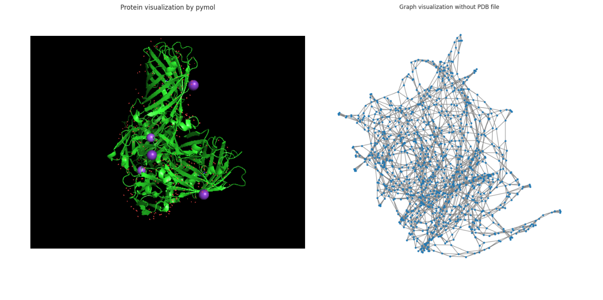
  

    <strong>Figure 1:</strong> Comparison between molecular and graph-based representations of the same protein structure. Left: PyMOL  molecular visualization showing secondary structure elements. Right: NetworkX graph representation displaying nodes (residues) connected by spatial proximity edges. The graph representation captures overall protein connectivity but does not clearly preserve the distinct secondary structure organization visible in the molecular model, illustrating the information loss during graph conversion.
  

Upon the first visualization we could observe among the issues the existence of several chains, not belonging to the same proteins but being clusters instead, which were treated by the preprocessing as one molecule. We therefore preprocessed the pdb files to have independent chains (each representing one unique nanobody) and converted into heterogeneous graphs.   

  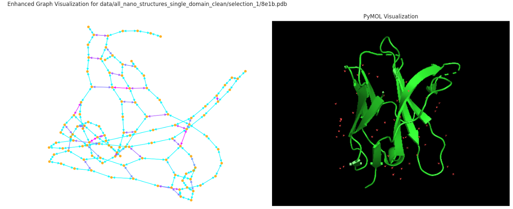
  

    <strong>Figure 2:</strong> Comparison of protein representation formats: NetworkX graph visualization (left) and PyMOL molecular structure (right) of the same nanobody. The graph format preserves connectivity and secondary structure patterns while simplifying atomic detail.
  

Ultimately the proteins were preprocessed in different steps, identifying the alpha carbon first, mapping the amino-acid types and the respective coordinates and computing the non-covalent interactions. The reconstruction can be visualized in the following 3D representation:

  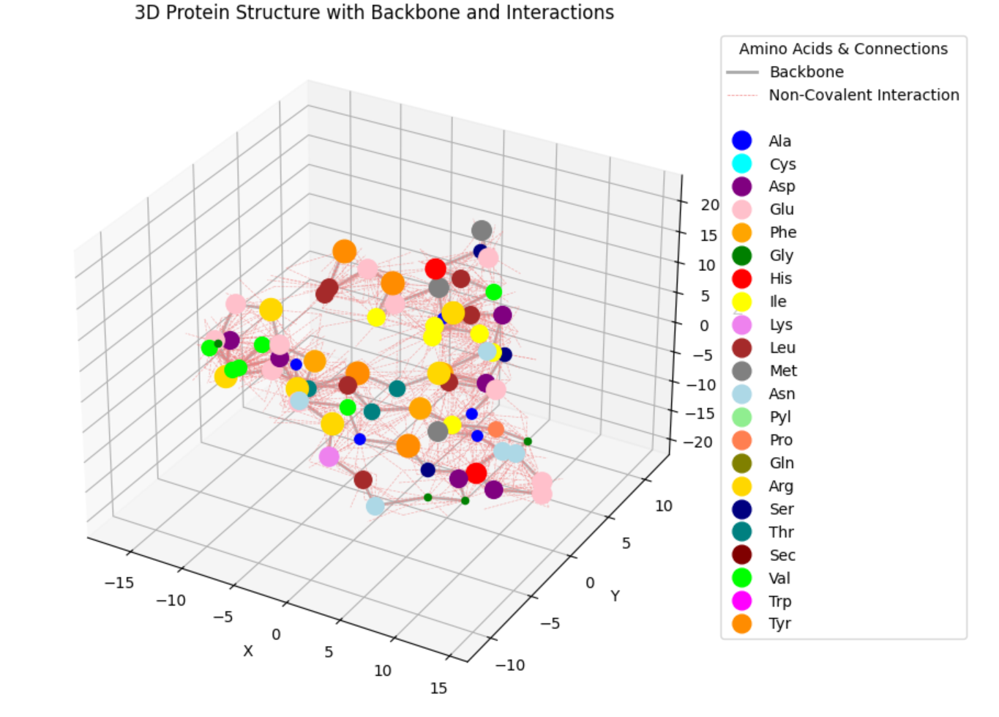
  

    <strong>Figure 3:</strong> 3D visualization of a protein structure showing amino acid residues as colored spheres according to type, connected by backbone bonds (gray lines) and non-covalent interactions (pink dashed lines). The compact, folded structure demonstrates typical protein architecture with diverse amino acid types distributed throughout the 3D space.
  

Upon success of the single chain strategy the same logic was implemented into the final preprocessing to graphs and associated dictionaries. 

### 6.2 Preprocessing and feature engineering 

Using BioPython, we parsed the structures at the atomic level, where each standard residue was extracted and stored by chain as a tuple representation of the form: 

$$
a_i = (\text{chain\_id}, r_i, t_i, a_i^n, e_i, \vec{x}_i)
$$

where:
- $r_i$ is the residue number,
- $t_i$ is the residue type (three-letter code),
- $a_i^n$ is the atom name,
- $e_i$ is the element,
- $\vec{x}_i \in \mathbb{R}^3$ is the atomic position.

Residue-level secondary structures were computed using DSSP, resulting in a mapping:

$$
(r_i, \text{chain\_id}) \mapsto s_i \in \{H, E, C, G, I, T, S, ?\}
$$

where $s_i$ denoted the DSSP-assigned secondary structure class.

Subsequently, residue-level protein graphs $G = (V, E)$ were built where $V$ represented node features and $E$ represented edge features (either peptide bonds or spatial proximity). We defined Edges $(i, j) \in \mathbb{E}$ by the following:

$$
\|\vec{x}_i^{CA} - \vec{x}_j^{CA}\|_2 < \delta \quad \text{with} \quad \delta = 7.0\,\text{\AA}
$$

#### 6.2.1 Geometric feature engineering and structural analysis

To characterize the 3D conformation of the protein chain we computed bond lengths, bond angles and torsion angles. These calculations were restricted to backbone atoms only (N, CA, C, O) to balance computational efficiency with essential structural information retention, though the underlying implementation was designed to support full-atom calculations for future extension.

Bond lengths were defined as Euclidean distances between bonded atoms:

$$
d_{ij} = \|\vec{x}_i - \vec{x}_j\|_2
$$

calculated between pairs of backbone atoms within the same residue or between sequential residues

For triplets of atoms (i, j, k), bond angles $\theta_{ijk}$ provided measures of angles formed by three consecutive atoms:

$$
\theta_{ijk} = \cos^{-1}\left( \frac{ (\vec{x}_i - \vec{x}_j) \cdot (\vec{x}_k - \vec{x}_j) }{ \|\vec{x}_i - \vec{x}_j\|_2 \cdot \|\vec{x}_k - \vec{x}_j\|_2 } \right)
$$

We considered only triplets involving backbone atoms, including intra-residue angles and inter-residue connections.

Torsion angles (dihedral angles) described rotational relationships between four sequential atoms, critical for capturing 3D folding patterns. We computed all the three canonical backbone torsions:

  - $\phi$: Rotation on the $N-CA$ bond
  - $\psi$: Rotation on the $CA–C$ bond
  - $\omega$: from $CA_{i–1}–C_{i–1}–N_i–CA_i$, reflecting the cis/trans conformation across the peptide bond. 

For atoms $(i, j, k, l)$ , the torsion angle $\phi$ were calculated using the angle between the planes formed by $(i, j, k)$ and $(j, k, l)$:

Let $\vec{b}_1 = \vec{x}_j - \vec{x}_i,  \vec{b}_2 = \vec{x}_k - \vec{x}_j,  \vec{b}_3 = \vec{x}_l - \vec{x}_k$

$$
\phi = \text{atan2}\left( \frac{ \vec{b}_2 \cdot (\vec{b}_1 \times \vec{b}_3) }{ \|\vec{b}_1 \times \vec{b}_2\|_2 \cdot \|\vec{b}_2 \times \vec{b}_3\|_2 }, (\vec{b}_1 \times \vec{b}_2) \cdot (\vec{b}_2 \times \vec{b}_3) \right)
$$

where $\vec{x}_i$, $\vec{x}_j$, $\vec{x}_k$, $\vec{x}_l$ were the 3D coordinates of the respective atoms. This formulation was applied uniformly across all torsion types.

#### 6.2.2 Physicochemical property integration:

Charges were estimated using predefined rules based on atom types:

$$
q_i = 
\begin{cases}
-0.5 & \text{if } e_i = \text{N} \\
0.5 & \text{if } e_i = \text{C} \\
-0.5 & \text{if } e_i = \text{O} \\
0 & \text{otherwise}
\end{cases}
$$

Hydrophobic residues were identified using a fixed set $H$, such that:

$$
\text{hydrophobic}(r_i) = \begin{cases}
1 & \text{if } t_i \in H \\
0 & \text{otherwise}
\end{cases}
$$

#### 6.2.3 Graph structure and feature integration

The resulting NetworkX graph structure incorporated comprehensive protein representations as summarized in the following node and edge attribute framework:

**Node Attributes:**  
- **Node ID**: Unique identifier following the format "chain_id:residue_name:residue_number"  
- **Chain ID**: Protein chain identifier
- **Residue Number**: Sequential position in protein
- **Residue Name**: Three-letter amino acid code
- **Secondary Structure**: DSSP classification (H, E, B, G, T, S, ?)
- **Backbone Presence**: Boolean indicating availability of backbone atoms (N, CA, C, O)
- **Coordinates**: 3D coordinates of CA atom
- **Optional Atomic Coordinates**: Full atomic coordinates when available

**Edge Attributes:**  
- **Connection Type**: Classification as {peptide_bond} or {contact}
- **Distance**: C-alpha distances for contact edges (measured in Ångströms)

### 6.3 Additional datasets for model validation and testing 

In addition to the nanobody dataset, which we ultimately used to develop and test our models, we employed several additional datasets to enhance model comprehension and assess methodological limits.  

**Synthetic Graph Validation Dataset**:To isolate our core methodology from biological complexity, we developed a controlled validation framework using synthetic graphs with known, controllable properties. We generated 2,500 synthetic graphs across five topological structures (circles, stars, grids, crosses, and line structures) with 8-20 nodes per graph. Node features included amino acid type encoding (21-dimensional one-hot), color features (5 categories), physicochemical properties (size, charge, hydrophobicity), and structural features (coordinates, degree, clustering coefficient).  

**Biological Validation Datasets**: We also utilized the SCOP dataset [[15]](#ref15) for diagnostic classification experiments to assess our graph representation capabilities, and an additional dataset of fluorescent proteins (which we termed "fluobodies") from the protein data bank.

## 7. Model flow

Building upon our systematic preprocessing foundation, we explored multiple computational approaches to protein structure generation. These explorations encompassed both theoretical innovations and practical implementations, ranging from contact map-based representations to advanced graph neural network architectures. Each approach was designed to address specific challenges in protein structure generation while building upon insights gained from previous attempts.

### 7.1 Graph Variational Autoencoder (GraphVAE)

VAEs have demonstrated success in molecular generation tasks [[16]](#ref16) [[17]](#ref17), and the graph structure seemed well-suited to capture protein spatial relationships. 

We built a custom GraphVAE following the standard variational auto-encoder structure with the following parameters: 
- input: 8-dimensional node features representing physicochemical properties
- hidden channels: 64-dimensional intermediate representations
- latent space: 16-dimensional bottleneck latent space (z)
- 4 attention heads for multi-head attention mechanism
- 1 dimensional edge attribute (distances)

  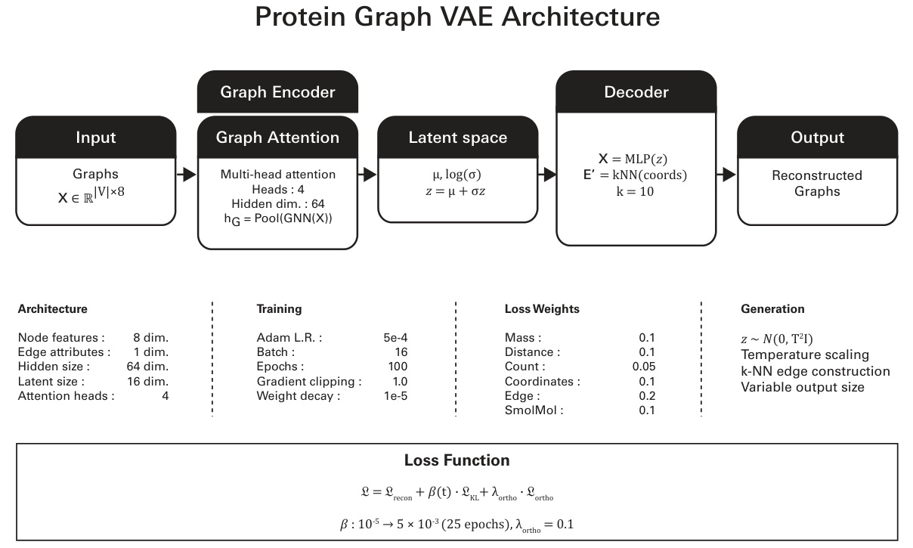
  

    <strong>Figure 4:</strong> Schematic representation of the Protein GraphVAE with weights and parameters 
  

The model was developed to handle variable-sized protein graphs without padding artifacts. The attention mechanism with 4 heads allowed the model to capture multiple types of relationships simultaneously within the protein structure.   

We built the loss function as a composite element including reconstruction loss ($\mathcal{L}$ _recon), KL divergence loss ($\mathcal{L}$ _KL ) and orthogonal regularization ($\mathcal{L}_{\text{ortho}}$). The reconstruction loss employed task-specific weighting to balance off different protein properties encoded in the graph structure. The KL parameter included a $\beta$-VAE with cyclical annealing to balance reconstruction quality and latent space organization with a warmup period t of 25 epochs: 

$$
\beta(t) = 
\begin{cases}
\beta_{\text{min}} + (\beta_{\text{max}} - \beta_{\text{min}}) \cdot \dfrac{t}{t_{\text{warmup}}} & \text{if } t < t_{\text{warmup}} \\
\beta_{\text{max}} & \text{if } t \geq t_{\text{warmup}}
\end{cases}
$$

the orthogonal regularization enforced normalization in the latent space representation: 

$$
\mu_{\text{normalized}} = \mathrm{F.normalize}(\mu, p=2, \text{dim}=1)
$$

$$
C = \frac{\mu_{\text{normalized}}^\top \mu_{\text{normalized}}}{\text{batch\_size}}
$$

$$
\mathcal{L}_{\text{ortho}} = \lambda_{\text{ortho}} \cdot \left\| C - I \right\|_F^2
$$

Where:

- $\lambda_{\text{ortho}} = 0.1$ is the orthogonality strength parameter  
- $C$ is the correlation matrix of normalized latent means  
- $I$ is the identity matrix  
- $\left\| \cdot \right\|_F$ is the Frobenius norm

The training involved a learning rate schedule with a reduction factor of 0.5 and 3-epochs patience. Gradient clipping was applied with max_norm=0.1 to prevent the exploding gradient issue. 

For the generator part we used 16-dimensional latent sampling $\mathbf{z} \sim \mathcal{N}(0, \sigma^2 I)$ from a standard normal distribution N(0,1) with temperature scaling to control the conservativiness of the generations. The generation was obtained as a step-wise process with a placeholder for the edge creation where each node connected to the next one in sequence in a ring connectivity pattern, through the decoder, the 16D vector was expanded into the full protein feature generating a matrix [1, nodes_per_graph, 8], where 8 were the initial input features, denormalized in the subsequent step. Lastly the coordinates were extracted, k-nearest neighbour edges constructed overwriting the initial edge scaffold and the graph object created. 

**Benefits and drawbacks**:  
Unlike traditional VAEs operating on fixed size inputs, our architecture handled variable-sized graphs through attention based pooling for size invariant encoding, dynamic batching with graph-level indices and flexible decoding supporting arbitrary output sizes. The model was able to simultaneously learn node-level chemical properties and structural features with graph-level batch indices through the multi-attention heads. 

While idealistically well engineered, being able to handle different protein size, decode the protein features through the latent space and to use 3D spatial relationships to determine realistic bonding, the model had a substantial limitation connected to the randomness of the latent sampling and reconstruction fidelity was often low. Information decoding required some optimization, especially on the amino acid assignment for the new nodes generated. Scalability was another issue, where memory usage became critical for large graphs or high batch sizes, edge reconstruction required further optimization.  

### 7.2 Hybrid Learning Inversion Framework

An alternative methodology demonstrating comparable performance was investigated, wherein the neural network operates as a component of a broader hybrid framework. This framework comprised five key stages: (i) data fragmentation, (ii) embedding, (iii) variational autoencoder, (iv) aggregation, and (v) data recovery through gradient-based optimization.

#### 7.2.1 Data Fragmentation

Rather than using full-length amino acid sequences as input, each sequence was fragmented into fixed-length subsequences of length L, where L represented a fraction of the maximum protein length (bandwidth). Each amino acid was thus associated with a corresponding subchain. To ensure uniform coverage and preserve the statistical properties of the original sequence, circular wrapping was applied, resulting in a consistent probability distribution across all subsequences.

The comparative study in Annex 1 established an empirical framework for the critical parameter length L, defined as 30% at least of maximum studied length. This parameter will vary depending on the dataset and the inner distribution of protein lengths.

  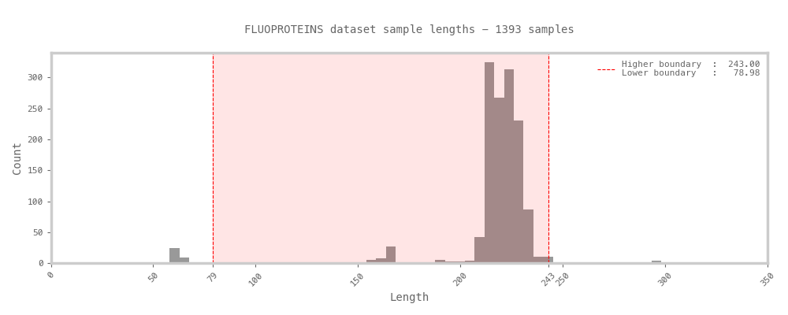
  

    <strong>Figure 5:</strong> In the Fluoproteins dataset, protein chain lengths exhibit a peak around 225 residues, with 99% of sequences containing no more than 233 residues. Based on this observation, a conservative chunk length of 78 residues was selected—representing approximately 35% of the maximum observed length. This choice ensures a minimum coverage bandwidth of 70%, providing sufficient context within each fragment while maintaining consistency across samples.

#### 7.2.2 Embedding

The original spatial data, represented as 3D atomic coordinates, were initially transformed into distance matrices — representations that are invariant to rotation and translation, thereby facilitating broader pattern recognition. These distance matrices were subsequently embedded into range-based contact maps. While this embedding entailed a significant loss of information, it offered the key advantage of converting continuous data into a binary representation. The contact maps were defined using a six-range percentile-based partitioning scheme, identified as optimal through the comparative analysis : this configuration balanced reconstruction accuracy with computational efficiency, and demonstrated consistent performance across diverse structures. Moreover, it ensured the homogeneous distribution of contacts across the maps, a property that appears particularly advantageous for neural network training.

  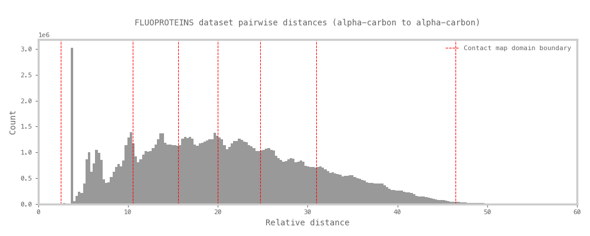
  

    <strong>Figure 6:</strong> Pairwise distance distribution across the Fluoproteins dataset. The strong initial peak corresponds to the typical 3.8 Å distance between consecutive alpha-carbon atoms in the protein backbone. Red lines indicate the six-range percentile thresholds used to define the boundaries for contact map embeddings.

#### 7.2.3 Modified Variational AutoEncoder (VAE)

A modified Variational Autoencoder (VAE) was subsequently trained using the following configuration:

- Input: one-hot encoded amino acid sequences, comprising 20 categories for standard residues and an additional category for unidentified residues.
- Output: six-range binary contact maps derived from spatial embeddings.
- Latent code dimensionality: 256.
- Weights Initialization: Glorot, normal.
- Activation: SoftMax(dim=-1). 
- Loss function: a weighted combination of Binary Cross-Entropy (BCE) and Kullback-Leibler (KL) divergence, with a tunable scaling factor σ applied to the KL term.
- Learning rate: A value of 2 × 10⁻⁵ was found to offer robust convergence and consistent performance.
- Optimizer: RMS-Prop.

  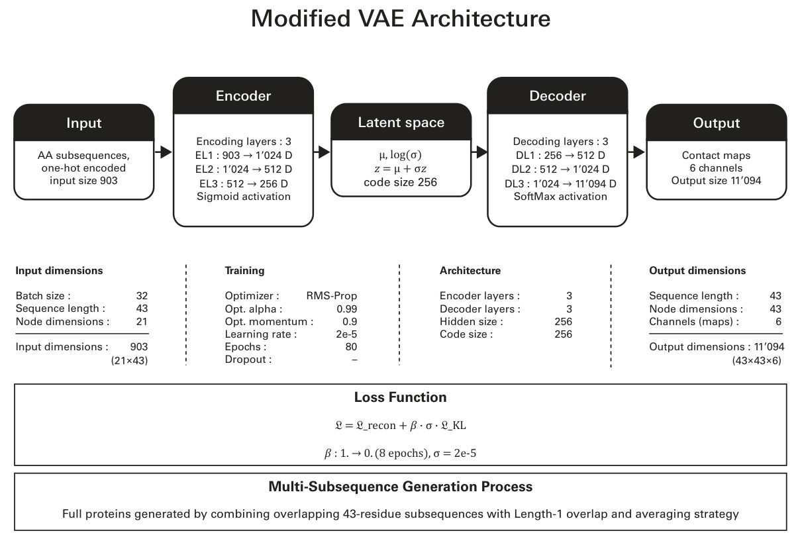
  

    <strong>Figure 7:</strong> Schematic representation of the modified VAE with weights and parameters 
  

Given the modified architecture of the VAE, the output was not intended to reconstruct the input sequence directly. Instead, it predicted a representation of the associated spatial structure — specifically, an embedded form of the structure encoded as a set of binary contact maps. This reflects a shift from traditional input reconstruction toward structured prediction, where the goal was to learn spatial constraints from sequence-based features.

Training was performed separately on two datasets, each comprising 20,000 samples derived from Nanobody and Fluoproteins structures, respectively. A 90/10 train–test split was employed, and models were trained over 80 epochs. At this stage, the loss curve for the test set reached a plateau, while the training loss continued to decrease. This divergence suggested that, under the current training configuration, the model had reached its optimal convergence point, beyond which additional training yields diminishing generalization performance.

#### 7.2.4 Aggregation

Local predictions from individual subsequences were aggregated and averaged to produce unified, protein-level contact map predictions. The two evaluated datasets showed promising results, with the predicted structures exhibiting visually accurate correspondence to the reference conformations.

  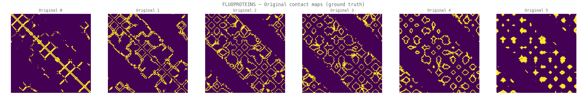
  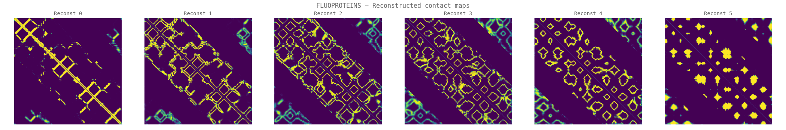
  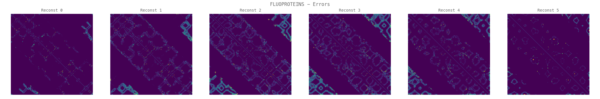
  

    <strong>Figures 8–10: </strong>Comparison for protein TC.
<strong>Figure 8 </strong>(top) presents the original contact maps derived from structural data, masked according to the chosen subsequence length.
<strong>Figure 9 </strong> (middle) shows the aggregated model predictions obtained by averaging local outputs from subsequences.
<strong>Figure 10 </strong> (bottom) displays the absolute difference between the predicted and original contact maps.
  

#### 7.2.5 Data Recovery through gradient-based optimization

The unified contact maps were subsequently processed through an optimization pipeline designed to approximating and recovering the corresponding three-dimensional structure. The reconstruction began by generating an initial distance matrix through random sampling within each defined contact range. This matrix was then used to produce a preliminary 3D structure via Multi-Dimensional Scaling (MDS). The resulting structure was further refined through a gradient-based optimization procedure, which minimized violations of the contact constraints by penalizing out-of-range distances using sigmoid-based functions (see [Appendix 1: Three-dimensional Structure Recovery through Gradient-Based Optimization](#appendix-1-three-dimensional-structure-recovery-through-gradient-based-optimization) for detailed procedure).

Across both datasets, the reconstructed structures were often closely aligned with the originals, with mean absolute error (MAE) distributions centered around 0.77 for the Fluoproteins and around 2.30 for the Nanobodies (averaged over 30 evaluations). The relatively higher error observed in the Nanobodies reconstructions may have stemmed from several factors: the broader structural diversity within this dataset likely increaseing the complexity of pattern extraction, potentially necessitating a larger training set. The selected latent space dimensionality of 256 may have been insufficient to effectively capture the complex and high-dimensional patterns, potentially limiting the representational capacity of the model.

  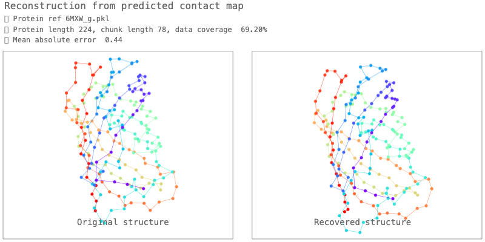
  

    <strong>Figure 11:</strong> Visual comparison of structures (original and recovered) of fluoprotein 6MXW, chain G.
  

#### 7.2.6 Benefits and drawbacks

Compared to the results obtained previously, the reconstructions achieved with this hybrid approach were more accurate and represented a significant improvement in protein structure prediction. The inversion framework demonstrated potential as a methodology for structural learning; in this framework data fragmentation emerged as a viable alternative to initial sequence length management through padding or masking, providing a straightforward technique for data augmentation. The binary embedding of spatial data was likely to facilitate the network learning.

However, this approach was not without limitations. One concern was the risk of overfitting to local patterns at the expense of capturing broader structural context. This issue was strongly influenced by the chosen subsequence length and the diversity of the training dataset. The overall complexity of the framework may also have hindered model interpretability and limit its scalability. In particular, when applied to larger proteins comprising thousands of residues, increasing the minimum chunk length could lead to a substantial expansion of the training dataset — growing quadratically with sequence length due to the rise in pairwise distance computations.

### 7.3 Additional diagnostic experiments 

Following the drawbacks of the first VAE implementation and the positive results from the optimization pipeline, we conducted diagnostic experiments using the GAT-VAE architecture on both the SCOP dataset and the Synthetic Graph Validation Dataset [[18]](#ref18). These experiments employed different approaches to better understand the model's fundamental capabilities and validate our architectural choices.

The motivation for this simplified approach came from examining classification methodologies that could provide clearer performance metrics and faster validation cycles, while also testing generative capabilities on controlled synthetic data.

For the SCOP classification experiments, we implemented a Graph Attention Network (GATNetwork) with multiple attention heads, using 3-layer GATConv modules with batch normalization and residual connections. The model architecture included a 64-dimensional hidden layer with 4 attention heads, followed by batch normalization and dropout (0.3) for regularization. The classification head consisted of two linear layers mapping to 7 classes corresponding to the SCOP structural categories. The SCOP dataset was preprocessed by filtering proteins to include only those with fewer than 300 residues to ensure computational feasibility, reducing the dataset from 3,420 to 2,717 proteins while maintaining balanced class representation across the 7 SCOP structural categories.

In parallel, we conducted generative experiments using synthetic graphs with controlled topological properties, allowing us to test the VAE generation mechanisms on simpler, well-understood structures before applying them to complex biological data. The synthetic graph experiments used an Enhanced Graph Variational Autoencoder with GAT layers, incorporating color embeddings, coordinate normalization, and feature normalization to handle the 13-dimensional input features effectively for graph generation tasks.

However, the SCOP classification results indicated limitations in our approach for capturing the complex structural relationships inherent in protein data. The classification task, while providing valuable insights into the attention mechanism's basic functionality, proved insufficient for demonstrating the model's capacity to handle the nuanced structural patterns required for protein generation. This highlighted the need for more sophisticated architectural approaches that could better leverage the sequential and spatial nature of protein structures.

These diagnostic experiments, while not meeting our expectations for SCOP classification, provided crucial insights that informed our subsequent decision to pursue the GRAN-inspired dual output architecture. The limitations observed reinforced the necessity of moving beyond simple classification tasks toward more sophisticated generative approaches that could better capture the complexity of protein structure relationships.

### 7.4 Graph recurrent attention network (GRAN)-inspired dual output architecture

Following the mixed results from the synthetic graph experiments and the SCOP classification task, and considering the encouraging outcomes from the VAE and the optimization pipeline, we proposed a different approach based on a Graph Recurrent Attention Network (GRAN). This decision was motivated by the strong performance of such networks on graph generation [[19]](#ref19) and the conceptual similarity of modeling proteins as sequential chains of amino acids, together with complete structural graphs. The original GRAN model used only a structural model and we wanted to keep the sequential nature too.

#### 7.4.1 Model architecture

  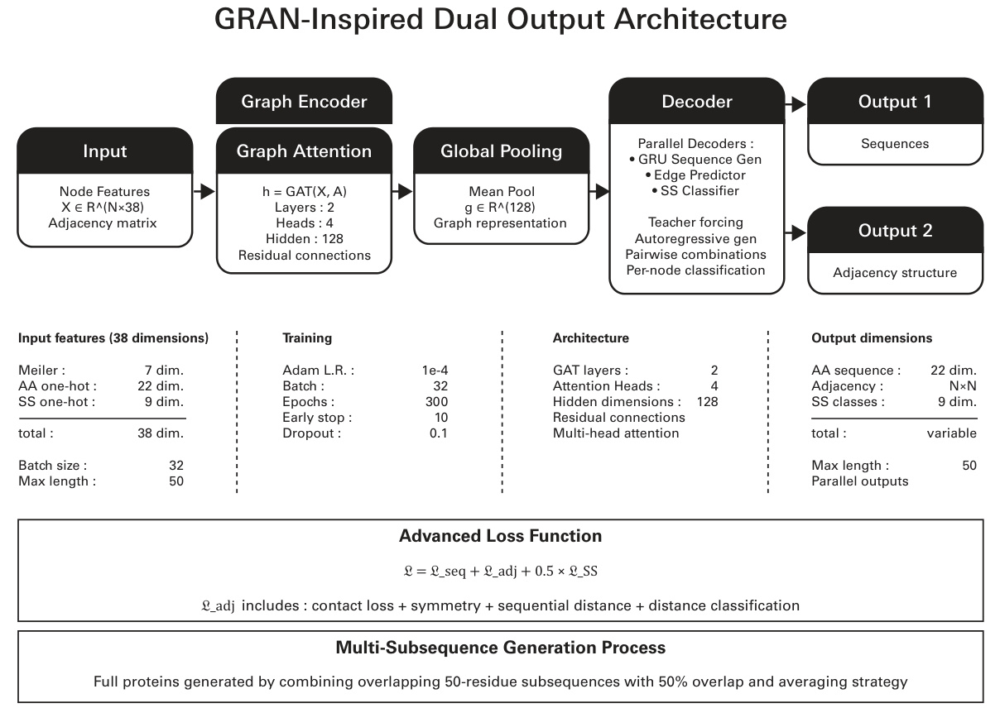
  

    <strong>Figure 12:</strong> Schematic representation of the GRAN model with weights and parameters.
  

Unlike variational autoencoders, this model did not use a probabilistic latent space with sampling. Instead, it directly mapped input graph features to dual outputs (sequence and structure) through deterministic neural network transformations with attention mechanisms.

The model was built for protein graphs as described, each node was characterized by a 38-dimensional feature vector comprising 7 physicochemical properties (size, flexibility, aromaticity, hydrogen bonding capacity, polarity, and electronic properties ), amino acid identity (22 dimensions, one-hot encoded) and secondary structure (9 dimensions, one-hot encoded). Each edge was characterized by the distance.  
The graph encoder employed a multi-layer Graph Attention Network (GAT) with residual connections, each of the 4 attention heads with 32 features for a total of 128 dimensions. Layer normalization was applied after each attention layer for training stability, while a 0.1 dropout rate was set to prevent overfitting. 

Following processing, a global graph representation was obtained by mean pooling:  

$$
\mathbf{h}_G = \frac{1}{|V|} \sum \mathbf{h}_i^{(\text{final})}
$$

Where:

- \( \mathbf{h}_G \): Global graph embedding  
- \( |V| \): Number of nodes in the graph  
- \( \mathbf{h}_i^{(\text{final})} \): Final hidden representation of node \( i \) 

that initialized a gated recurrent unit (GRU)-based autoregressive sequence decoder:

$$
\mathbf{h}_t = \mathrm{GRU}(\mathbf{x}_{t-1}, \mathbf{h}_{t-1})
$$

$$
p(a_t \mid a_{<t}) = \mathrm{softmax}(W_{\text{seq}} \, \mathbf{h}_t + \mathbf{b}_{\text{seq}})
$$

Where:

- \( \mathbf{h}_t \): Hidden state at time step \( t \)  
- \( \mathbf{x}_{t-1} \): Input at time step \( t-1 \) (embedding of the previously generated amino acid)  
- \( \mathbf{h}_{t-1} \): Hidden state at time step \( t-1 \)  
- \( a_t \): Action (or output) at time step \( t \)  
- \( a_{<t} \): Sequence of actions preceding time \( t \)  
- \( W_{\text{seq}} \), \( \mathbf{b}_{\text{seq}} \): Trainable weight matrix and bias vector  
- \( \mathrm{softmax} \): Normalized exponential function for computing class probabilities 

During training, teacher forcing was employed using ground truth sequences to reduce compounding errors [[20]](#ref20). For inference multinomial sampling was performed from the predicted distributions.  
The dual output was represented by the amino acid sequence (via the sequence generation branch) and a 3D adjacency matrix (from the structure generation branch), with an auxiliary prediction head to estimate secondary structure probability for each residue. This provided additional structure supervision and enabled structure aware sequence generation. 

As previously developed for the first VAE, and envisioning future applications in physically constrained models, the loss was a composite function with weighted terms. A standard cross entropy loss for the amino acid prediction (first output branch) and multi component contact loss for the structure generation branch including basic contact loss as binary cross entropy between true and predicted, sequential distance constrains penalizing deviations from the expected CA-CA distance, symmetry regularization to minimize asymmetry in the contact maps and a final term to rank the interactions. The full loss function is summarized in the following equation and further explained in Appendix 2: 

$$
\mathcal{L}_{\text{total}} = \mathcal{L}_{\text{seq}} + \mathcal{L}_{\text{adj}} + 0.5 \times \mathcal{L}_{\text{ss}}
$$

where: 

- \( \mathcal{L}_{\text{seq}} \): Loss for sequence generation branch  
- \( \mathcal{L}_{\text{adj}} \): Loss for structure generation branch 
- \( \mathcal{L}_{\text{ss}} \): Loss for secondary structure prediction  
- Coefficient \( 0.5 \): Weighting factor 

#### 7.4.2 Additional preprocessing and the generation process

The early findings about the benefit on splitting the protein in 50-unites sequences described above, as well as the additional requirements to generate potentially biologically plausible structures required additional preprocessing in the data pipeline to calculate the missing parameters and chunking. Additionally, upon suggestion of a generative model [[21]](#ref21) and upon common practice in machine learning tasks [[22]](#ref22) we implemented some data augmentation by creating multiple overlapping windows for training. 

Training was performed using the hyperparameters listed in Table 1, with each epoch requiring approximately 30 minutes on an NVIDIA GeForce RTX 3080 GPU. 

| **Component**           | **Details**                                                                 |
|-------------------------|------------------------------------------------------------------------------|
| Optimization            | Adam optimizer with learning rate $5 \times 10^{-4}$, weight decay $1 \times 10^{-5}$ |
| Learning Rate Scheduling| ReduceLROnPlateau, factor 0.5, patience 3 epochs                            |
| Regularization          | Gradient clipping (max norm 1.0), Dropout rate 0.1, Early stopping (patience 10, min 30 epochs) |
| Batch Processing        | Fixed batch size of 16 using 50-residue protein subsequences                |

**Table 1**: GRAN-inspired dual output model hyperparameters.

The generation process employed a novel multi-subsequence aggregation strategy to create full-length proteins from a model trained on 50-residue subsequences. The process worked as follows: (1) The full target protein length was divided into overlapping 50-residue windows with 50% overlap (step size of 25 residues), (2) for each window, input graph features were processed through graph attention layers to create node embeddings, (3) a global graph representation was obtained through mean pooling, which initialized a GRU-based autoregressive decoder that generated the subsequence, (4) simultaneously, an edge predictor network processed pairwise node embeddings to predict the corresponding adjacency matrix segment, (5) overlapping regions between subsequences were averaged - for sequence positions, the most frequently predicted amino acid was selected using a voting mechanism, while for adjacency matrices, overlapping values were arithmetically averaged, (6) the final full-length protein was assembled by concatenating all subsequences and averaging their overlapping regions, and (7) 3D structure reconstruction was performed through gradient-based optimization using the final aggregated contact map with a binary threshold of 0.065.

#### 7.4.3 Training performance and model convergence 

The model showed good convergence characteristics across all loss components during training with stable performance reached approximately after epoch 50. 

  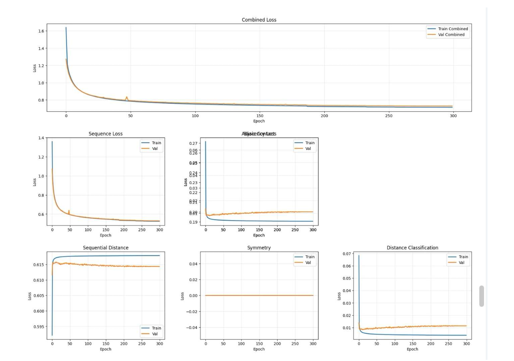
  

    <strong>Figure 13:</strong> Training logs from the GRAN model.
  

Once trained, the contact map prediction achieved an accuracy of 99.51% 

  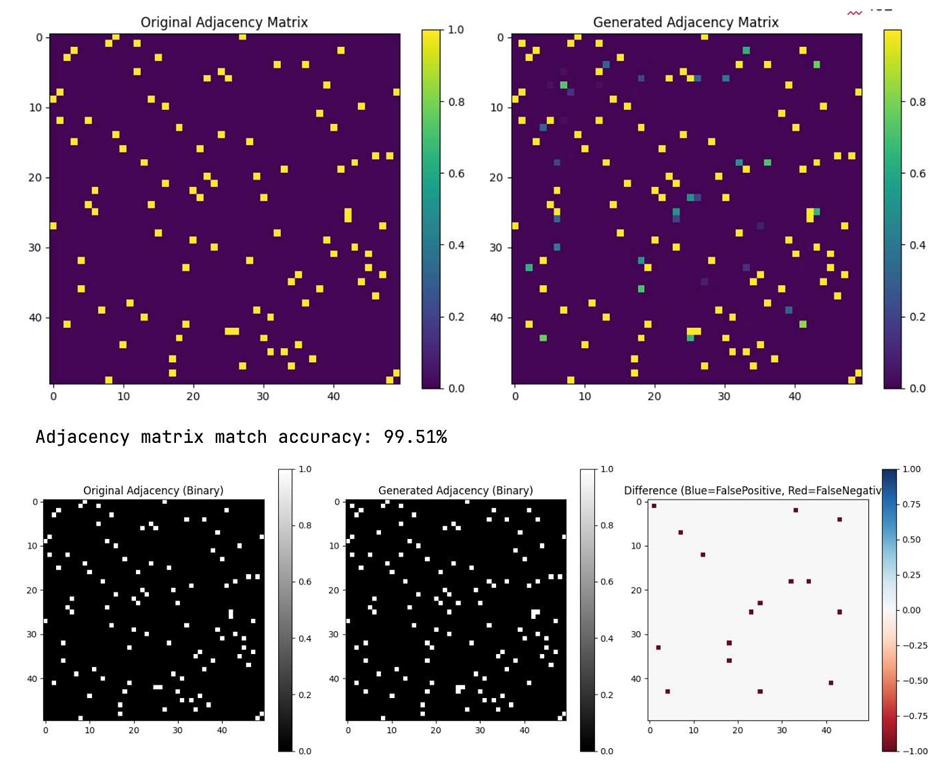
  

    <strong>Figure 14:</strong> Contact map prediction accuracy analysis with binary comparison and difference analysis.
  

The 3D structure was generated and converted in pdb file for reading through PyMOL.  

  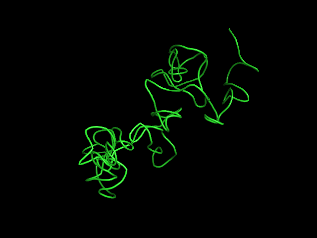
  

    <strong>Figure 15:</strong> cartoon visualization of the generated protein through PyMOL.
  

  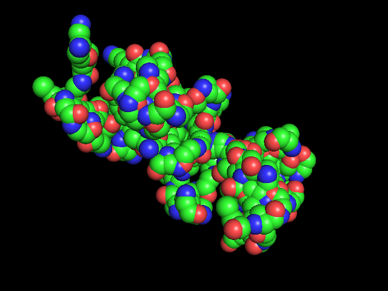
  

    <strong>Figure 16:</strong> surface visualization of the generated protein through PyMOL. Blue and red areas represent charged residues, green and yellow area represent hydrophobic regions. 
  

Despite plausible contact map and realistic fold topology and backbone connectivity, the amino acid distribution and the disposition of the charged and hydrophobic residues do not follow yet the pattern of a folded protein indicating further optimization needed.  

#### 7.4.4 Benefits and drawbacks

One advantage of this new approach—originally inspired by a generative model and subsequently developed further—was its ability to generate the sequence and structure in parallel, enabling consistency between the primary and tertiary structures through joint training. The multi component contact loss was a first attempt of a potentially further developable loss, including the physical-constraining parameters, the information passed through the 38-dimensional nodes were very rich and the multi attention head enabled the model to focus selectively on different type of residue interactions. 

The model was, however, severely constrained by the maximum sequence length of 50 residues, limitation that would increase the computational complexity of $O(N^2)$ graph attention operations on adjacency matrices with the increase of the sequence length. Additionally, the model did not contain in this first implementation angles and torsions, computed in the preprocessing and essential in the structural biology for realistic side chain configurations. From the described generation process the model generated proteins by building 50-residues subsequences and averaging them together, with the risk of introducing discontinuities in the final structure. For more complex datasets the complex multi-component loss function may be difficult to balance.   

## 8. Documentation

We employed different level of documentation to ensure reproducibility and effective collaboration. Notebooks and python files were documented through the use of a version control system (GitHub) with README files and  refactorization as appropriate.   
Experiments were tracked using Weight and Biases through systematic experiments. Models were saved through checkpoints to enable training over several days without losing the progresses. 

## 9. Risks

Protein structures are extremely complex systems to be interpreted and studied. This intrinsic complexity was reflected in the generative task where not only a plausible amino acid sequence had to be generated, but secondary and tertiary structures had to be predicted depending both on the sequence generated and on many biological constraints. This high complexity was acknowledged by the authors through the numerous attempts to evaluate different strategies without success.

With this awareness, the risk of generating implausible structures was high, especially without strong physico-biological constraints. The current stage of the project focused mainly on studying the different generation strategies and their limitations in order to develop the most suitable strategy. The aforementioned risk was therefore not of concern at this stage but will be considered in the development of the PINN.

Another risk connected with the use of complex networks with relatively small amounts of data (approximately 3000 structures) was overfitting, and in our case, as explained in the data section, the limited robustness. Only similar structures or synthetic data were selected on purpose in this specific case, as the focus was rather on the study of the generative task for biological systems.

## 10. Conclusions 
The early results indicated that the studied architectures, with the required optimizations, may be potentially capable of capturing both sequence–structure relationships and the complex constraints governing protein folding, enabling the generation of plausible structures.  

The first ProteinGraphVAE had the ability to learn both node-level properties and structural features, while handling gracefully different protein sizes but with low fidelity in the reconstruction, which could be potentially improved by a strongly physically constrained loss (absent in this model). The hybrid learning inversion framework proved to be very promising in the handling of long protein chains and variable length, while improving the fidelity of the reconstruction, though the fixed chunk length represented a limitation on the reconstruction of bigger proteins which could be plausibly overcome by sequence overlapping techniques or by using more powerful frameworks for training with longer sequence chunks. Ultimately the GRAN model showed great potential through the dual output mechanism and the auxiliary secondary structure validation strategy, but still required optimization in the generation to ensure plausibility of the generated new proteins.   

Further validation will be required to assess the performance of these models in more diverse datasets, like the pH dataset newly developed. Furthermore, the generative capabilities of our PINN GNN will not be dedicated to new proteins but to the same input protein, simplifying the generation task by removing the biological plausibility constraint, as the output would be strongly constrained on the input with regard to the sequence order. With this in mind, our thorough investigation provided us sufficient data and encouraging results to proceed with the development of the physically constrained system originally planned.

## References

[1] Nelson, David L., and Michael M. Cox. Lehninger Principles of Biochemistry. 6th ed. W. H. Freeman, 2012.

[2] Paszke, A., Gross, S., Massa, F., Lerer, A., Bradbury, J., Chanan, G., ... & Chintala, S. (2019). PyTorch: An imperative style, high-performance deep learning library. Advances in neural information processing systems, 32.

[3] Fey, M., & Lenssen, J. E. (2019). Fast graph representation learning with PyTorch Geometric. arXiv preprint arXiv:1903.02428.

[4] Aric A. Hagberg, Daniel A. Schult and Pieter J. Swart, “Exploring network structure, dynamics, and function using NetworkX”, in Proceedings of the 7th Python in Science Conference (SciPy2008), Gäel Varoquaux, Travis Vaught, and Jarrod Millman (Eds), (Pasadena, CA USA), pp. 11–15, Aug 2008

[5] Kabsch, W., & Sander, C. (1983). Dictionary of protein secondary structure: pattern recognition of hydrogen-bonded and geometrical features. Biopolymers, 22(12), 2577–2637. https://doi.org/10.1002/bip.360221211

[6] Graphein - a Python Library for Geometric Deep Learning and Network Analysis on Protein Structures
Arian R. Jamasb, Pietro Lió, Tom L. Blundell
bioRxiv 2020.07.15.204701; doi: https://doi.org/10.1101/2020.07.15.204701

[7] Google Colab. (2017). Colaboratory: A Google research project. Google Research. https://colab.research.google.com/

[8] UBELIX (https://www.id.unibe.ch/hpc), the HPC cluster at the University of Bern.  

[9] Biewald, L. (2020). Experiment tracking with Weights and Biases. Software available from wandb.com. URL: https://www.wandb.com/

[10] Casual Labs. (2025). GRAN-Nanobody-Proteins Dataset. Hugging Face. https://huggingface.co/Casual-Labs/gran-nanobody-proteins

[11] Berman, H. M., Westbrook, J., Feng, Z., Gilliland, G., Bhat, T. N., Weissig, H., Shindyalov, I. N., & Bourne, P. E. (2000). The Protein Data Bank. Nucleic Acids Research, 28(1), 235-242. https://doi.org/10.1093/nar/28.1.235

[12] Chang A., Jeske L., Ulbrich S., Hofmann J., Koblitz J., Schomburg I., Neumann-Schaal M., Jahn D., Schomburg D. BRENDA, the ELIXIR core data resource in 2021: new developments and updates. (2021), Nucleic Acids Res., 49:D498-D508. DOI: 10.1093/nar/gkaa1025 PubMed: 33211880

[13] Cock, P.J.A. et al. Biopython: freely available Python tools for computational molecular biology and bioinformatics. Bioinformatics 2009 Jun 1; 25(11) 1422-3 https://doi.org/10.1093/bioinformatics/btp163 pmid:19304878

[14] PyMOL, The PyMOL Molecular Graphics System, Version 3.0 Schrödinger, LLC.

[15] Antonina Andreeva, Dave Howorth, Cyrus Chothia, Eugene Kulesha, Alexey Murzin, SCOP2 prototype: a new approach to protein structure mining. (2014) Nucl. Acid Res., 42 (D1): D310-D314 and Antonina Andreeva, Eugene Kulesha, Julian Gough, Alexey Murzin, The SCOP database in 2020: expanded classification of representative family and superfamily domains of known protein structures. (2020) Nucl. Acid Res., 48 (D1): D376-D382

[16] De Cao, Nicola & Kipf, Thomas. (2018). MolGAN: An implicit generative model for small molecular graphs. 10.48550/arXiv.1805.11973. 

[17] Basu, V. (2024, December 2017). Drug molecule generation with VAE. Keras. https://mng.bz/rKve

[18] Korman, A. (2023). Prediction of protein movement upon ligand binding using equivariant graph neural networks. Stanford CS224W: Machine Learning with Graphs. Medium. https://medium.com/stanford-cs224w/prediction-of-protein-movement-upon-ligand-binding-using-equivariant-graph-neural-networks-a1f4b2c8b8a0

[19] Efficient Graph Generation with Graph Recurrent Attention Networks
Renjie Liao, Yujia Li, Yang Song, Shenlong Wang, Charlie Nash, William L. Hamilton, David Duvenaud, Raquel Urtasun, Richard S. Zemel
 

[20] Lamb, Alex & Goyal, Anirudh & Zhang, Ying & Zhang, Saizheng & Courville, Aaron & Bengio, Y.. (2016). Professor Forcing: A New Algorithm for Training Recurrent Networks. 10.48550/arXiv.1610.09038. 

[21] Claude (Anthropic). (2025). Claude Sonnet 4 [Large language model]. June 2025, from https://claude.ai

[22] Hernandez-Garcia, Alex & König, Peter. (2019). Further advantages of data augmentation on convolutional neural networks. 10.48550/arXiv.1906.11052. 

## List of Figures

## List of Tables

## Appendix

### Appendix 1: Three-dimensional Structure Recovery through Gradient-Based Optimization

This short study proposes an empirical framework for tuning the parameters of an optimization pipeline designed to reconstruct the three-dimensional expression of a structure from partial contact maps. These contact maps, derived from local fragment predictions based on sequence subsequences, represent incomplete spatial interaction data. To recover the full 3D structure, a process comparable to a "reverse embedding" is employed, which maps the partial contact information back into spatial coordinates.

The study shows that the inversion process — despite the inherent loss of information caused by encoding continuous numerical values into binary, featurized contact maps — can approximate the original spatial configurations with reasonable accuracy, thereby rendering the embedding process partially reversible. However, the quality of the recovered structures strongly depends on the amount of available data, as well as on parameters such as the numerical range boundaries that define the distribution of contacts within the maps, or the amount of maps involved.

#### Data

Three sets of coordinates, each representing a distinct structural configuration, are analyzed to explore contrastive spatial distributions:
<ol type="1"><li><strong>Single Large Point Cloud</strong> – A synthetically generated, uniformly distributed set of points forming one cluster.
</li>
<li><strong>Multiple Small Point Clouds</strong> – A synthetic configuration composed of several smaller, spatially disparate clusters sampled from a Gaussian distribution. 
</li>
<li><strong>Real-World Nanoprotein Data</strong> – Empirical atomic coordinates of the alpha-carbon atoms of protein 4POY, chain A residues, exhibiting a naturally "organic" spatial distribution.
</li></ol>

For the sake of comparison, all three sets contain an identical number of points (120), and are normalized to comparable spatial scales, with the maximum inter-point distance approximately 35 units in each case.

#### Embedding process

The original 3D coordinates are converted into pairwise distance matrices using standard Euclidean norm. Each point is then represented as a 120-dimensional vector, capturing its distances to all other points in the structure. The distance matrices are symmetric, with zeros along the main diagonal. To constrain local context, a subsequence length is defined, determining the bandwidth of the distance matrices. A corresponding mask is applied such that all distance values outside this window are zeroed out;

The resulting distance matrices are then converted into range-based contact maps, based on three key parameters: 
- the <b>bandwidth coverage</b>;
- the <b>number of discrete ranges</b> used for data partitioning;
- the <b>numerical boundaries</b> that define these ranges.

A set of basic constraints is imposed: given the continuous nature of pairwise distance distributions in each dataset, the range domains are defined to cover the entire extent of the distance domain. Additionally, to prevent ambiguous contact information and ensure the resulting contact maps remain compatible with probabilistic operations, the domains are contiguous and non-overlapping.

The specific distribution of each structure leads us to consider several approaches to domain partitioning : 
- <b>Percentiles</b>. A quantitative boundary ensures the homogeneous distribution of contacts between domains;
- <b>Sectors</b>. Qualitative demarcation, distributing distances between sectors of equal width;
- <b>Structural</b>. An “organic” demarcation based on the “ripples” visible on certain distribution curves, sensitive to the intrinsic structure of the data.

The embedding process results in 2 objects:
- a tensor of shape (𝑁,𝑁,𝐶), where 𝑁 is the number of points in the dataset, and 𝐶 is the number of contact maps (i.e., distance ranges).
- a list of numercial values describing the boundaries of each distance range.

#### Reverse embedding process

The reverse embedding process consists of 2 stages departing from the embeddings and the list obtained earlier :
<ol type="1"><li>
  <b>MDS pipeline</b>. A first matrix of distances is produced by taking a uniform random value within the boundaries of the respective domains expressed by the contacts; the matrix is then reduced to three dimensions via a classical MDS (Multidimensional Scaling); these values constitute a first approximation of the 3D coordinates and are used as initialization values for a table of logits; </li>
  <li><b>Optimization pipeline</b>. Logits are fed into an optimization loop, which translates them into relative distances and compares them with contact information. This optimization process relies entirely on a double sigmoid which “validates” the proposed values when they fall within the expected range, and penalizes them when they fall outside it, all in a continuous and differentiable manner (soft ranges). Proposed values are compared with target values by BCE. </li>
</ol>

The process returns a set of three-dimensional coordinates whose relative distances correspond as closely as possible to the contact maps.

#### Systematic experiments

Systematic experiments were conducted to map the interactions between the datasets and the three key parameters, and to identify optimal settings. The recovered structures were then compared to the original ones using absolute mean error and cosine similarity scores.

**1. MDS pipeline**

Our analysis revealed that coordinate recovery was straightforward when complete distance matrices were available, with Multidimensional Scaling achieving extremely low error (MAE = 0.0000 for uniform structures) in very short process time. 

However, when using contact matrices with information loss, MDS relied on prototype distance matrices based on random sampling from contact domains. We found that:
- Partitioning into sectors of identical width gave optimal results
- Percentile partitioning followed closely in performance  
- Structural partitioning yielded least accurate results

  
  

    <strong>Figure 17:</strong> MDS reconstruction systematic study.
  

**2. Gradient-Based Optimization Pipeline**

Our systematic analysis revealed significant improvements over MDS prototypes using Gradient-Based Optimization:
- **Error Reduction**: Mean absolute error greatly reduced with significant improvement between 0-20% coverage
- **Coverage Optimization**: For protein structures, performance plateaued around 60% coverage
- **Domain Number Impact**: More contact matrix domains consistently improved reconstruction quality
- **Partitioning Strategy**: Percentile partitioning proved most efficient for optimization, while structural partitioning was least effective

  
  

    <strong>Figure 18:</strong> Optimized reconstructions systematic study.
  

### Appendix 2: GRAN loss function 

The total loss was computed as combination of the three individual contribution from the sequence generation branch, the structure generation branch and the auxillary secondary structure branch:

$$
\mathcal{L}_{\text{total}} = \mathcal{L}_{\text{seq}} + \mathcal{L}_{\text{adj}} + 0.5 \times \mathcal{L}_{\text{ss}}
$$

Each of the individual losses described by the following formulations: 

$$
L_{seq} = -\frac{1}{T} \sum_{t=1}^{T} \log p(a_t^{\text{true}} \mid a_{<t})
$$
$$
L_{\text{adj}} = 1.0 \times L_{\text{contact}} + 0.3 \times L_{\text{sequential}} + 0.3 \times L_{\text{symmetry}} + 0.4 \times L_{\text{distance}}
$$
$$
L_{\text{ss}} = -\frac{1}{N} \sum_{i=1}^{N} \log p\left(ss_i^{\text{true}} \mid h_i\right)
$$

Where:

- $T$ is the sequence length  
- $a_t^{\text{true}}$ is the true token at position $t$  
- $a_{<t}$ denotes the sequence of tokens before time step $t$  
- $L_{\text{contact}}$ is the loss enforcing contact map constraints  
- $L_{\text{sequential}}$ penalizes non-sequential edges  
- $L_{\text{symmetry}}$ enforces adjacency matrix symmetry  
- $L_{\text{distance}}$ penalizes physically implausible edge distances  
- $N$ is the number of residues  
- $ss_i^{\text{true}}$ is the true secondary structure label at position $i$  
- $h_i$ is the encoded representation of residue $i$

The $\mathcal{L}_{\text{adj}}$ was itself combination of multiple factors described by the following equations: 

$$
L_{\text{contact}} = \mathrm{BCE}(A_{\text{pred}} \odot M,\ A_{\text{true}} \odot M)
$$

$$
L_{\text{sequential}} = \frac{1}{2} \left[
\mathrm{MSE}(\mathrm{diag}_1(A_{\text{pred}}),\ 0.9 \times \mathbf{1}) +
\mathrm{MSE}(\mathrm{diag}_2(A_{\text{pred}}),\ 0.7 \times \mathbf{1})
\right]
$$

$$
L_{\text{symmetry}} = \frac{1}{N^2} \sum_{i,j} \left| A_{\text{pred}}[i,j] - A_{\text{pred}}[j,i] \right|
$$

$$
L_{\text{distance}} = 0.3 \times L_{\text{local}} + 0.3 \times L_{\text{medium}} + 0.4 \times L_{\text{long}}
$$

$$
L_{r} = \mathrm{BCE}(A_{\text{pred}} \odot M_r,\ A_{\text{true}} \odot M_r) \times \left( \sum M_r + \varepsilon \right)^{-1}
$$

**Mask definitions:**

$$
M_{\text{local}}[i,j] =
\begin{cases}
1 & \text{if } 1 \leq |i - j| \leq 5 \\
0 & \text{otherwise}
\end{cases}
$$

$$
M_{\text{medium}}[i,j] =
\begin{cases}
1 & \text{if } 5 < |i - j| \leq 20 \\
0 & \text{otherwise}
\end{cases}
$$

$$
M_{\text{long}}[i,j] =
\begin{cases}
1 & \text{if } |i - j| > 20 \\
0 & \text{otherwise}
\end{cases}
$$

Which combined all together gave the following final formulation for the total loss of the GRAN dual output architecture: 

$$
\begin{aligned}
\mathcal{L}_{\text{total}} =\ & 
-\frac{1}{T} \sum_{t=1}^{T} \log p(a_t^{\text{true}} \mid a_{<t}) \\
& + \Big[1.0 \times \text{BCE}(A_{\text{pred}} \odot M,\ A_{\text{true}} \odot M) \\
& \quad + 0.3 \times \frac{1}{2} \big(\text{MSE}(\text{diag}_1(A_{\text{pred}}),\ 0.9 \cdot \mathbf{1}) + \text{MSE}(\text{diag}_2(A_{\text{pred}}),\ 0.7 \cdot \mathbf{1})\big) \\
& \quad + 0.3 \times \frac{1}{N^2} \sum_{i,j} \left|A_{\text{pred}}[i,j] - A_{\text{pred}}[j,i]\right| \\
& \quad + 0.4 \times \big(0.3 \cdot \mathcal{L}_{\text{local}} + 0.3 \cdot \mathcal{L}_{\text{medium}} + 0.4 \cdot \mathcal{L}_{\text{long}}\big)\Big] \\
& + 0.5 \times \left[-\frac{1}{N} \sum_{i=1}^{N} \log p(ss_i^{\text{true}} \mid \mathbf{h}_i)\right]
\end{aligned}
$$

**Where:**

- $T$: Length of the output sequence  
- $a_t^{\text{true}}$: Ground truth token at step $t$  
- $a_{<t}$: Sequence of preceding tokens  
- $A_{\text{pred}}, A_{\text{true}}$: Predicted and true adjacency matrices  
- $M$: Binary mask matrix  
- $\odot$: Element-wise (Hadamard) product  
- $\text{BCE}$: Binary cross-entropy loss  
- $\text{MSE}$: Mean squared error  
- $\text{diag}_k(A)$: $k$-th diagonal of matrix $A$  
- $N$: Number of nodes in the graph  
- $\mathcal{L}_{\text{local}}, \mathcal{L}_{\text{medium}}, \mathcal{L}_{\text{long}}$: Losses for different edge distance regimes  
- $ss_i^{\text{true}}$: Ground truth secondary structure label for node $i$  
- $\mathbf{h}_i$: Final node embedding of node $i$

